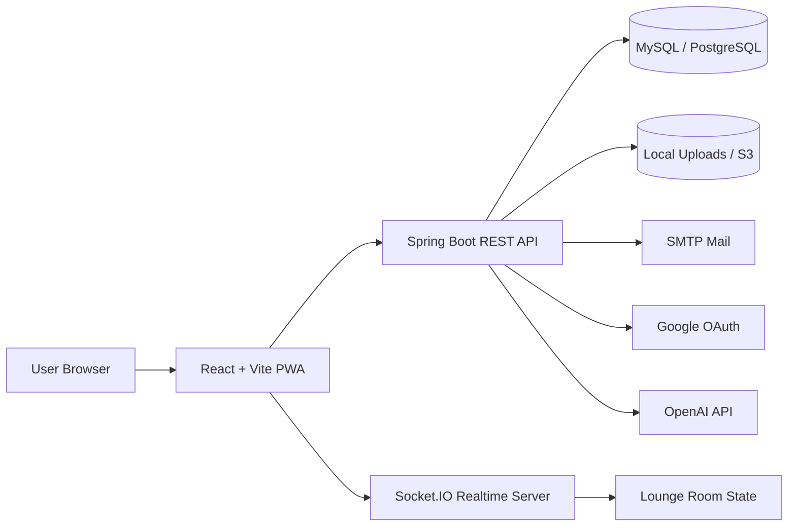

# 득근득근 MuscleUp

> 운동 기록을 게임처럼 지속하게 만드는 피트니스 커뮤니티 플랫폼

득근득근 MuscleUp은 출석 체크, 캐릭터 성장, 랭킹, 운동 모임, 실시간 라운지, AI 인바디 분석을 하나의 루프로 연결한 풀스택 웹 애플리케이션입니다. 사용자는 매일의 운동 기록을 남기고, 그 기록이 캐릭터 성장과 커뮤니티 활동으로 이어지는 경험을 통해 운동 습관을 지속할 수 있습니다.

## 목차

- [프로젝트 개요](#프로젝트-개요)
- [주요 기능](#주요-기능)
- [기술 스택](#기술-스택)
- [아키텍처](#아키텍처)
- [핵심 설계 포인트](#핵심-설계-포인트)
- [주요 화면 흐름](#주요-화면-흐름)
- [API 구성](#api-구성)
- [프로젝트 구조](#프로젝트-구조)
- [실행 방법](#실행-방법)
- [환경변수](#환경변수)
- [빌드 및 검증](#빌드-및-검증)
- [배포 구조](#배포-구조)
- [포트폴리오 관점의 구현 하이라이트](#포트폴리오-관점의-구현-하이라이트)
- [보안 고려사항](#보안-고려사항)

## 프로젝트 개요

운동 앱은 기록을 남기는 순간에는 유용하지만, 꾸준히 돌아오게 만드는 장치는 약한 경우가 많습니다. 이 프로젝트는 운동 기록을 단순한 데이터 입력이 아니라 "오늘의 퀘스트"로 만들고, 출석과 활동이 캐릭터, 랭킹, 크루, 라운지에 즉시 반영되도록 설계했습니다.

핵심 목표는 세 가지입니다.

- 운동 기록을 습관화할 수 있는 게임형 피드백 루프 제공
- 사용자 간 응원, 경쟁, 모임 참여를 통한 커뮤니티 유지
- AI 기반 분석과 리포트로 개인화된 운동 의사결정 지원

## 주요 기능

| 영역 | 기능 |
| --- | --- |
| 인증 | 이메일 인증, 일반 로그인, Google OAuth 로그인, JWT access/refresh token, 쿠키 기반 세션 유지 |
| 출석 | 오늘의 운동/휴식 기록, 월간 출석 로그, 연속 출석, 출석 공유 페이지, 응원 및 신고 |
| 캐릭터 | 운동 기록 기반 캐릭터 성장, 티어, 레벨, 진화 단계, MBTI/성장 파라미터 기반 아바타 렌더링 |
| 랭킹 | 캐릭터 랭킹, 주간 연속 출석 랭킹, 월간 미디어 공유 랭킹 |
| AI 피트니스 | 운동 분석, 운동 계획 추천, AI 채팅, 인바디 이미지/PDF 기반 상담, 공유 링크 생성 |
| 커뮤니티 | 운동 자랑 게시판, 댓글, 좋아요, 리뷰, 단백질 나눔, 단백질 신청 및 채팅 |
| 크루 | 운동 모임 생성, 초대코드 참가, 가입 승인, 크루 챌린지, 크루 로비, 하이라이트 |
| 실시간 라운지 | Socket.IO 기반 실시간 접속자 동기화, 캐릭터 이동, 채팅, 이모트, 스티커, 파티 요청 |
| 이벤트 | 공개 이벤트 목록, 상세 페이지, 조회/클릭 기록, 관리자 이벤트 생성 및 배너 관리 |
| 관리자 | 사용자 활동 로그, 신고/콘텐츠 관리, 프로그램 신청 관리, 문의 관리, 이벤트 CMS |
| 파일 | 로컬 업로드와 S3 업로드를 모두 고려한 파일 업로드, 프록시, 목록 조회, 삭제 |

## 기술 스택

### Frontend

| 기술 | 사용 목적 |
| --- | --- |
| React 19 | 사용자 화면 구성 |
| TypeScript | 정적 타입 기반 UI 개발 |
| Vite | 개발 서버 및 프로덕션 빌드 |
| React Router | 페이지 라우팅과 보호 라우트 |
| TanStack React Query | 서버 상태 관리 기반 |
| Axios / Fetch | REST API 통신 |
| Tailwind CSS | UI 스타일링 |
| Recharts | 통계 시각화 |
| Socket.IO Client | 실시간 라운지 및 친구 채팅 |
| Vite PWA | PWA manifest, service worker, 이미지 캐싱 |

### Backend

| 기술 | 사용 목적 |
| --- | --- |
| Java 17 | 백엔드 런타임 |
| Spring Boot 3.5 | REST API 서버 |
| Spring Security | 인증/인가, 필터 체인, 권한 제어 |
| Spring Data JPA | 도메인 모델 영속화 |
| MySQL / PostgreSQL | 로컬 및 배포 DB 대응 |
| JWT | access token, refresh token 발급 및 검증 |
| JavaMailSender | 이메일 인증 코드 발송 |
| Google API Client | Google ID Token 검증 |
| AWS SDK S3 | 이미지/영상 업로드 스토리지 연동 |
| PDFBox | AI 리포트 PDF 처리 |
| Gradle | 빌드 및 의존성 관리 |

### Realtime Server

| 기술 | 사용 목적 |
| --- | --- |
| Node.js | 실시간 서버 런타임 |
| TypeScript | Socket 이벤트 타입 관리 |
| Socket.IO | 라운지 플레이어 동기화, 채팅, 소셜 이벤트 |
| tsx | 개발 중 TypeScript watch 실행 |

## 아키텍처



서비스는 세 개의 실행 단위로 나뉩니다.

| 실행 단위 | 역할 | 기본 포트 |
| --- | --- | --- |
| `frontend` | 사용자 웹앱, PWA, 라우팅, API 클라이언트 | `5173` |
| `backend` | 인증, 도메인 API, 파일, 관리자, AI 연동 | `8080` |
| `realtime` | 라운지 접속자 상태, 이동, 채팅, 소셜 이벤트 | `4001` |

## 핵심 설계 포인트

### 1. 운동 기록을 게임 루프로 연결

출석 체크는 단순 기록으로 끝나지 않고 캐릭터 성장, 랭킹, 라운지 프로필, 크루 활동으로 이어집니다. 사용자가 하루 한 번 행동하면 여러 화면에서 즉시 피드백을 받을 수 있도록 설계했습니다.

### 2. REST API와 실시간 서버 분리

백엔드는 인증, 도메인 데이터, 관리자 기능을 담당하고, 실시간 라운지는 별도 Socket.IO 서버가 담당합니다. 라운지 서버는 플레이어 위치, 채팅, 이모트, 파티 요청처럼 빈번하게 변하는 상태를 REST API와 분리해 처리합니다.

### 3. 쿠키와 로컬 토큰을 모두 고려한 인증 흐름

프론트엔드는 요청 인터셉터에서 access token을 자동 첨부하고, 401 응답 발생 시 refresh API를 통해 토큰을 갱신합니다. 백엔드는 쿠키와 Bearer token을 모두 처리할 수 있도록 구성되어 브라우저 환경과 배포 환경의 차이를 흡수합니다.

### 4. AI 기능의 서비스화

AI 분석, 운동 계획, 채팅, 인바디 상담, PDF 리포트를 API 단위로 분리했습니다. 사용자는 분석 결과를 개인 기록으로 보관하거나 공유 링크로 외부에 전달할 수 있습니다.

### 5. 운영 관리 기능 포함

관리자 화면은 단순 조회를 넘어 콘텐츠 삭제, 이벤트 관리, 신청 상태 변경, 문의 상태 변경, 감사 로그 확인까지 포함합니다. 포트폴리오용 데모가 아니라 실제 운영을 염두에 둔 관리 기능을 구현했습니다.

## 주요 화면 흐름

| 경로 | 설명 |
| --- | --- |
| `/` | 출석, 캐릭터, 라운지, 이벤트가 연결된 메인 로비 |
| `/login`, `/register` | 로그인, 회원가입, 이메일 인증, Google 로그인 |
| `/attendance` | 오늘의 운동/휴식 기록과 월간 출석 관리 |
| `/rankings` | 캐릭터 및 활동 기반 랭킹 |
| `/mypage` | 내 캐릭터, 운동 통계, 성장 기록 |
| `/ai`, `/ai/inbody` | AI 운동 상담과 인바디 분석 |
| `/brag` | 운동 자랑 게시판 |
| `/protein` | 단백질 나눔 게시판과 신청 흐름 |
| `/crew` | 운동 모임 생성, 탐색, 참가 |
| `/crew/:crewId/challenges` | 크루 챌린지 관리 |
| `/lounge` | 실시간 캐릭터 라운지 |
| `/events` | 공개 이벤트 목록과 상세 |
| `/admin` | 관리자 대시보드 |
| `/admin/events` | 이벤트 CMS |

## API 구성

| Prefix | 역할 |
| --- | --- |
| `/api/auth` | 로그인, 로그아웃, 토큰 갱신, 이메일 인증, Google 로그인, 내 정보 |
| `/api/users` | 회원가입 |
| `/api/attendance` | 출석 기록, 공유, 응원, 신고, 출석 랭킹 |
| `/api/character` | 캐릭터 조회, 평가, 공개 설정, 휴식 상태, 재생성 |
| `/api/rankings` | 캐릭터 랭킹 |
| `/api/ai` | AI 분석, 계획, 채팅, 인바디 상담, PDF, 공유 |
| `/api/brags` | 자랑 게시글, 댓글, 좋아요 |
| `/api/reviews` | 리뷰 CRUD |
| `/api/proteins` | 단백질 나눔, 신청, 신청자 채팅 |
| `/api/crew` | 크루 생성, 참가, 승인, 챌린지 |
| `/api/events` | 공개 이벤트, 참여 이벤트, 이벤트 지표 |
| `/api/files` | 파일 업로드, 삭제, 프록시, 목록 조회 |
| `/api/mypage` | 마이페이지 요약 |
| `/api/mypage/stats` | 사용자 신체/운동 통계 |
| `/api/lounge` | 실시간 라운지 입장용 프로필 |
| `/api/support` | 문의 등록, 지원 챗봇 |
| `/api/admin` | 관리자 통계, 감사 로그, 콘텐츠 관리, 신청/문의 관리 |

## 프로젝트 구조

```text
Ajou_MuscleUp
├── backend
│   ├── src/main/java/com/ajou/muscleup
│   │   ├── config          # Security, JWT, CORS, Scheduler, Storage 설정
│   │   ├── controller      # REST API 엔드포인트
│   │   ├── dto             # 요청/응답 DTO
│   │   ├── entity          # JPA 도메인 모델
│   │   ├── repository      # Spring Data JPA Repository
│   │   ├── scheduler       # 이벤트 스케줄링
│   │   └── service         # 비즈니스 로직
│   ├── src/main/resources  # Spring profile 설정
│   ├── src/test            # 테스트와 AI 품질 하네스
│   └── sql                 # DB 마이그레이션 스크립트
├── frontend
│   ├── src
│   │   ├── components      # 공통 컴포넌트, 아바타 렌더러
│   │   ├── layouts         # Header, Footer
│   │   ├── pages           # 라우트 페이지
│   │   ├── services        # API 서비스 모듈
│   │   ├── styles          # 화면별 스타일
│   │   └── types           # 프론트엔드 타입
│   └── public              # PWA 아이콘 등 정적 파일
├── realtime
│   └── src                 # Socket.IO 서버, 라운지 room state
└── docs                    # 기능 검증 문서
```

## 실행 방법

### 사전 준비

- Java 17
- Node.js 20 이상 권장
- MySQL 또는 PostgreSQL
- OpenAI API Key
- Google OAuth Client ID/Secret
- SMTP 계정
- S3 사용 시 AWS S3 bucket

### 1. 저장소 클론

```bash
git clone https://github.com/toadsam/Ajou_MuscleUp.git
cd Ajou_MuscleUp
```

### 2. Backend 실행

`backend/src/main/resources/application-local.properties` 파일을 만들고 로컬 환경값을 채웁니다.

```properties
spring.datasource.url=jdbc:mysql://localhost:3306/muscleup?useSSL=false&allowPublicKeyRetrieval=true&createDatabaseIfNotExist=true&serverTimezone=Asia/Seoul&characterEncoding=utf8
spring.datasource.username=root
spring.datasource.password=YOUR_DB_PASSWORD
spring.datasource.driver-class-name=com.mysql.cj.jdbc.Driver

spring.jpa.hibernate.ddl-auto=update
spring.jpa.database-platform=org.hibernate.dialect.MySQLDialect

spring.mail.host=smtp.gmail.com
spring.mail.port=465
spring.mail.username=YOUR_MAIL_ADDRESS
spring.mail.password=YOUR_MAIL_APP_PASSWORD
spring.mail.properties.mail.smtp.auth=true
spring.mail.properties.mail.smtp.starttls.enable=false
spring.mail.properties.mail.smtp.ssl.enable=true
spring.mail.properties.mail.smtp.ssl.trust=smtp.gmail.com

openai.api.key=YOUR_OPENAI_API_KEY
google.client-id=YOUR_GOOGLE_CLIENT_ID
google.client-secret=YOUR_GOOGLE_CLIENT_SECRET
jwt.secret=CHANGE_THIS_TO_A_LONG_RANDOM_SECRET_VALUE
cors.allowed-origins=http://localhost:5173
app.frontend-base-url=http://localhost:5173
app.cookie.secure=false
app.cookie.same-site=Lax
```

서버 실행:

```bash
cd backend
./gradlew bootRun
```

Windows PowerShell에서는 다음처럼 실행할 수 있습니다.

```powershell
cd backend
.\gradlew.bat bootRun
```

### 3. Realtime 서버 실행

```bash
cd realtime
npm install
npm run dev
```

기본 실행 주소는 `http://localhost:4001`입니다.

### 4. Frontend 실행

```bash
cd frontend
npm install
npm run dev
```

프론트엔드 기본 실행 주소는 `http://localhost:5173`입니다.

## 환경변수

### Backend

| 변수 | 설명 | 예시 |
| --- | --- | --- |
| `PORT` | 백엔드 서버 포트 | `8080` |
| `SPRING_PROFILES_ACTIVE` | Spring profile | `local`, `prod` |
| `DB_URL` | JDBC URL | `jdbc:postgresql://host:5432/db` |
| `DB_USERNAME` | DB 사용자 | `muscleup` |
| `DB_PASSWORD` | DB 비밀번호 | `password` |
| `PGHOST`, `PGPORT`, `PGDATABASE`, `PGUSER`, `PGPASSWORD` | PostgreSQL 배포 환경용 변수 | 배포 플랫폼 값 |
| `MAIL_USERNAME` | SMTP 계정 | `example@gmail.com` |
| `MAIL_PASSWORD` | SMTP 앱 비밀번호 | `app-password` |
| `OPENAI_API_KEY` | AI 기능용 API key | `sk-...` |
| `GOOGLE_CLIENT_ID` | Google OAuth client id | `...apps.googleusercontent.com` |
| `GOOGLE_CLIENT_SECRET` | Google OAuth secret | `...` |
| `JWT_SECRET` | JWT 서명 secret | 충분히 긴 랜덤 문자열 |
| `CORS_ALLOWED_ORIGINS` | 허용할 프론트엔드 origin 목록 | `http://localhost:5173` |
| `FRONTEND_BASE_URL` | 공유 링크 생성용 프론트엔드 주소 | `http://localhost:5173` |
| `UPLOAD_DIR` | 로컬 업로드 디렉터리 | `uploads` |
| `S3_ENABLED` | S3 사용 여부 | `true`, `false` |
| `S3_BUCKET` | S3 bucket 이름 | `muscleup-bucket` |
| `AWS_REGION` | AWS region | `ap-northeast-2` |
| `S3_PREFIX` | S3 object prefix | `uploads` |
| `S3_PUBLIC_BASE_URL` | 공개 파일 base URL | `https://cdn.example.com` |

### Frontend

| 변수 | 설명 | 예시 |
| --- | --- | --- |
| `VITE_API_BASE` | 백엔드 API base URL. 비워두면 Vite proxy 사용 | `http://localhost:8080` |
| `VITE_REALTIME_URL` | Socket.IO 서버 주소 | `http://localhost:4001` |

### Realtime

| 변수 | 설명 | 예시 |
| --- | --- | --- |
| `PORT` | 실시간 서버 포트 | `4001` |
| `ORIGIN` | 허용할 프론트엔드 origin. 쉼표로 여러 개 지정 가능 | `http://localhost:5173` |

## 빌드 및 검증

### Backend

```bash
cd backend
./gradlew test
./gradlew clean bootJar
```

### Frontend

```bash
cd frontend
npm run lint
npm run build
```

### Realtime

```bash
cd realtime
npm run build
```

## 배포 구조

백엔드는 `backend/nixpacks.toml`을 통해 Java 17 기반 빌드와 `bootJar` 실행을 고려해 구성되어 있습니다.

```text
Frontend    정적 빌드 산출물을 웹 서버 또는 정적 호스팅에 배포
Backend     Spring Boot jar 실행, prod profile 사용
Realtime    Node.js 프로세스로 Socket.IO 서버 실행
Database    MySQL 또는 PostgreSQL
Storage     로컬 업로드 또는 S3
```

운영 환경에서는 다음 값을 반드시 환경변수로 주입해야 합니다.

- DB 접속 정보
- `JWT_SECRET`
- `OPENAI_API_KEY`
- Google OAuth 값
- SMTP 계정
- CORS 허용 origin
- S3 사용 시 AWS/S3 관련 값

## 포트폴리오 관점의 구현 하이라이트

### 실시간 라운지

라운지는 단순 채팅방이 아니라 캐릭터가 움직이는 월드 형태의 실시간 공간입니다. 서버는 플레이어 위치, 접속자 목록, 채팅, 타이핑, 이모트, 스티커, 파티 요청을 Socket.IO 이벤트로 관리합니다. 클라이언트는 이동 입력과 렌더링을 분리해 부드러운 상호작용을 제공하도록 구성했습니다.

### 캐릭터 성장 시스템

운동 기록과 사용자 통계를 캐릭터 성장 요소로 연결했습니다. 티어, 진화 단계, 성장 파라미터, 휴식 상태, MBTI 값을 아바타 렌더링에 반영해 사용자의 활동이 시각적으로 드러나도록 설계했습니다.

### AI 인바디 상담

인바디 이미지/PDF 기반 상담, 운동 계획, 채팅, PDF 리포트 생성 흐름을 제공합니다. AI 응답은 단발성 답변이 아니라 히스토리와 공유 기능으로 연결되어 사용자가 결과를 다시 확인하거나 외부에 공유할 수 있습니다.

### 운영 가능한 관리자 기능

관리자 API와 화면을 별도로 구성해 이벤트 CMS, 신고 콘텐츠 관리, 문의 상태 관리, 프로그램 신청 관리, 감사 로그 조회를 처리합니다. 실제 서비스 운영에서 필요한 관리 흐름을 프로젝트 범위 안에 포함했습니다.

### 공유 중심 기능

출석 공유, AI 상담 공유, 운동 자랑 게시글, 단백질 나눔, 이벤트 상세 페이지처럼 외부 링크나 커뮤니티 반응으로 이어지는 기능을 여러 도메인에 배치했습니다. 개인 기록 앱이 아니라 커뮤니티 서비스로 동작하도록 설계한 부분입니다.

## 보안 고려사항

- JWT access token과 refresh token을 분리했습니다.
- refresh token은 서버 저장소와 함께 관리해 만료/폐기 흐름을 처리합니다.
- 관리자 API는 관리자 권한이 있는 사용자만 접근하도록 보호합니다.
- CORS origin은 환경별로 분리합니다.
- 파일 업로드는 로컬 저장소와 S3 저장소를 모두 지원하도록 추상화했습니다.
- 운영 환경의 secret은 코드에 포함하지 않고 환경변수로 주입하는 것을 전제로 합니다.

## 작성자

| 항목 | 내용 |
| --- | --- |
| 프로젝트 | 득근득근 MuscleUp |
| 형태 | Full-stack web application |
| 주요 구현 범위 | React PWA, Spring Boot REST API, Socket.IO realtime server, AI integration, admin dashboard |
| 목적 | 운동 기록을 지속 가능한 커뮤니티 경험으로 바꾸는 서비스 구현 |

## 라이선스

이 저장소는 포트폴리오 공개를 목적으로 합니다. 별도 라이선스가 명시되기 전까지 코드와 자산의 무단 사용, 복제, 배포를 허용하지 않습니다.
