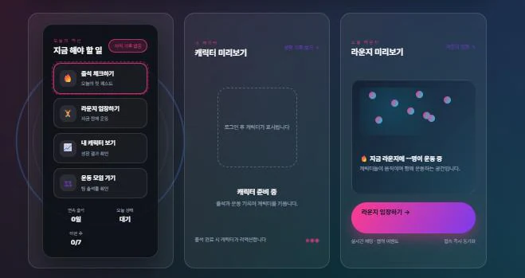
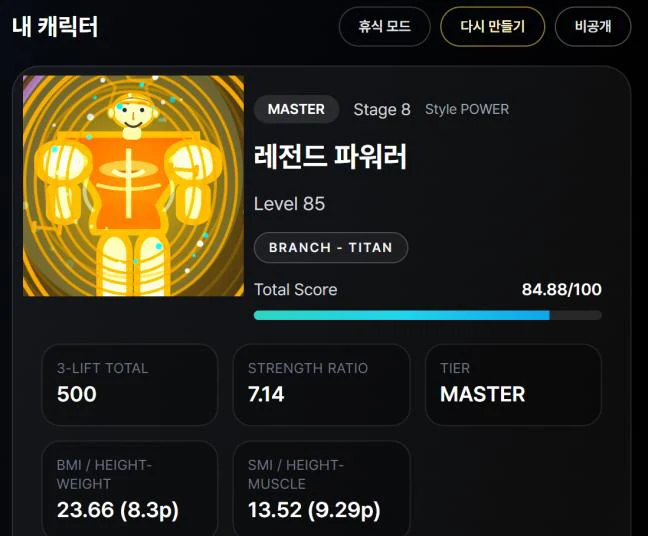
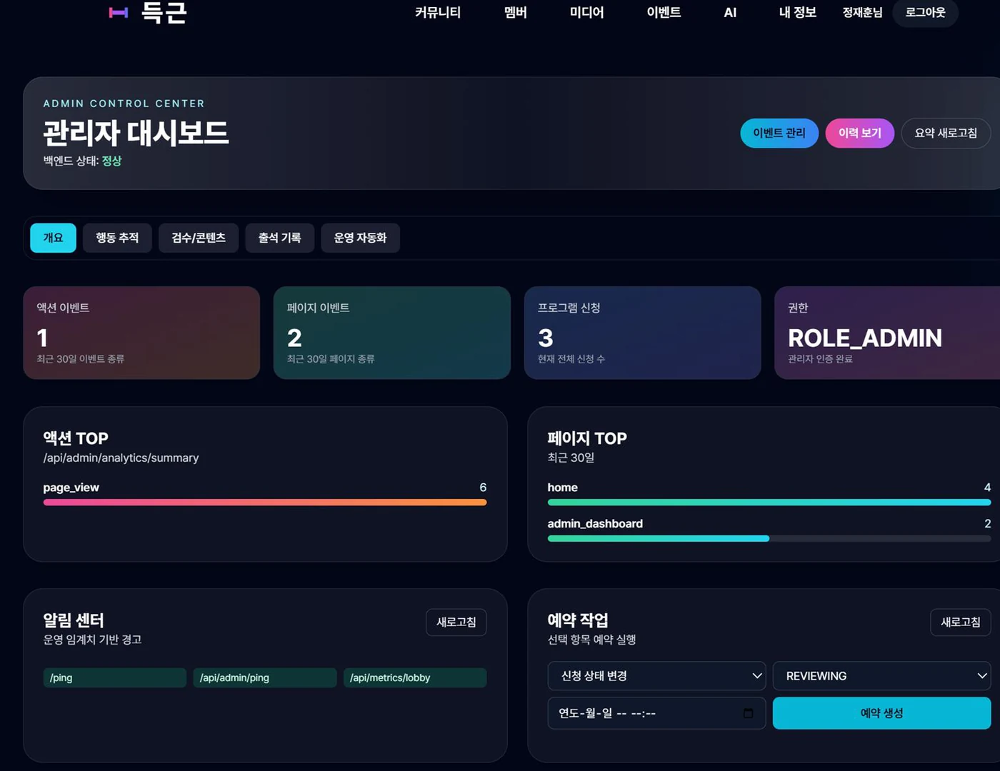
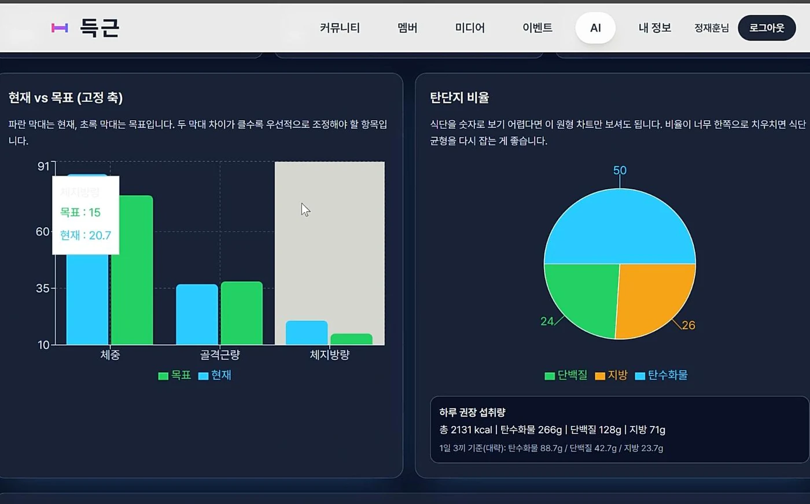
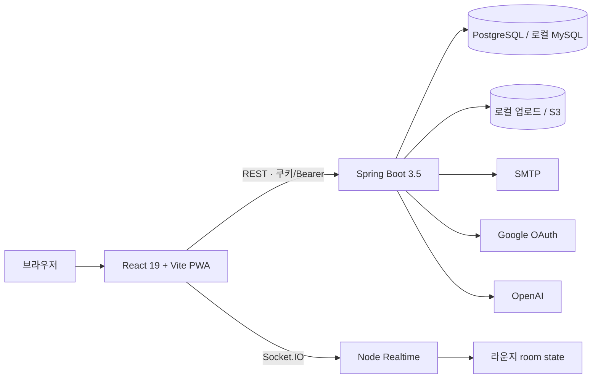

# 득근득근 MuscleUp

운동 기록이 캐릭터 성장·랭킹·실시간 라운지로 되돌아오는 피트니스 커뮤니티. 혼자 기획하고 만들고 배포해서 실제 회원 약 50명이 쓰고 있다.


| | |
|---|---|
| 기간 | 2025.09 ~ (첫 커밋 2025-09-03, 189 커밋) |
| 인원 | 1명 — 기획 · UI · API · 인증 · 배포 · 운영 전부 |
| 배포 | https://ajou-muscle-up.vercel.app (프론트 Vercel · 백엔드 Railway · PostgreSQL) |
| 영상 | https://youtu.be/0X-BIADC1eQ |

## 5분만 있다면

1. [`RefreshTokenService.rotate()`](backend/src/main/java/com/ajou/muscleup/service/RefreshTokenService.java#L39-L51) — 교과서대로 넣은 Refresh 로테이션을 하루 만에 걷어낸 자리. 아래 「넣었다가 뺀 것」에 이유가 있다.
2. [`docs/BENCHMARKS.md`](docs/BENCHMARKS.md) — 이 저장소가 주장하는 성능 수치 두 개를 직접 다시 잴 수 있게 만든 스크립트와 실측표. 쿼리가 700배 빨라졌는데 사용자는 2배만 빨라진 이유가 거기 있다.
3. [`realtime/src/server.ts`](realtime/src/server.ts) — REST 와 분리한 Socket.IO 라운지 서버. 60ms 틱, 변한 게 있을 때만 브로드캐스트. 100명에서 꺾이고 그 원인이 CPU 가 아니라는 것까지 재 두었다.

## 무엇이 돌아가나

| | |
|---|---|
|  |  |
| 첫 화면은 소개가 아니라 **오늘의 할 일 목록**이다. 출석이 메인 액션이고 나머지 퀘스트가 그 아래 선다. | 라운지. 캐릭터가 같은 공간을 돌아다니고 채팅·이모트·스티커·파티 요청이 Socket.IO 로 오간다. 좌상단이 접속자 수와 핑. |
|  |  |
| 운동 기록이 캐릭터가 된다. 티어·단계·점수는 `character_profiles` 컬럼 그대로다. 공개하면 랭킹에 오른다. | 관리자는 조회 화면이 아니라 운영 콘솔이다. 감사 로그, 신고 콘텐츠 검수, 프로그램 신청 상태, 이벤트 CMS, 예약 작업. |

이 밖에 이메일 인증 + Google 로그인, 월간 출석 로그와 연속 출석, 크루(초대코드·가입 승인·챌린지), 운동 자랑 게시판, 단백질 나눔, AI 인바디 분석(이미지·PDF)과 운동 계획, 공유 링크, 로컬/S3 이중 업로드가 있다.



## 1.0 에서 2.0 으로 — 들은 말과 고친 것

1.0 은 **보여 주는 홈페이지**였다. 기능을 소개하고 분위기를 전달하는 랜딩이었고, 그때는 그게 맞다고 생각했다. 써 본 사람들이 남긴 말이 넷 있었고, 그 말이 2.0 을 만들었다.

| 사용자가 한 말 (1.0 발표자료 p.24) | 2.0 에서 한 것 |
|---|---|
| "처음 사용할 때 어디서 뭘 해야 할지 몰랐어요" | 홈을 로비로 바꿨다. 「오늘 출석 시작」이 첫 화면의 메인 액션이 됐다. |
| "다른 사람들과 더 많이 소통하고 싶어요" | 게시판으로는 「같이 있다」가 안 됐다. 실시간 라운지와 크루를 만들었다. |
| "내 운동 데이터를 더 자세히 보고 싶어요" | 숫자를 더 보여 주는 대신 기록이 자라는 걸 보이게 했다 — 캐릭터 레벨·티어·진화, 공개 랭킹. |
| "AI 답변이 나올 때까지 기다리는 게 길어요" | **아직 못 했다.** 2.0 에서 AI 는 인바디 OCR 로 오히려 무거워졌다. 스트리밍 응답과 캐싱이 다음 차례다. |

넷 중 셋. 안 한 하나를 그대로 적어 두는 편이 나머지 셋을 믿게 만든다고 생각한다.

## 구조


```mermaid
flowchart LR
  User[브라우저] --> FE[React 19 + Vite PWA]
  FE -->|REST · 쿠키/Bearer| BE[Spring Boot 3.5]
  FE -->|Socket.IO| RT[Node Realtime]
  BE --> DB[(PostgreSQL / 로컬 MySQL)]
  BE --> S3[(로컬 업로드 / S3)]
  BE --> Mail[SMTP]
  BE --> Google[Google OAuth]
  BE --> OpenAI[OpenAI]
  RT --> Room[라운지 room state]
```

**REST 와 실시간을 다른 프로세스로 둔 이유.** 라운지는 플레이어 위치·채팅·이모트처럼 초당 여러 번 바뀌는 상태고, 나머지는 하루에 몇 번 바뀌는 상태다. 한 서버에 두면 위치 브로드캐스트가 인증·출석·게시판 요청과 같은 스레드 풀을 놓고 다툰다. 그래서 라운지 서버는 DB 를 모른다 — `lounge:join` 때 받은 프로필을 메모리 room 에 들고 있다가 `/status` 로 접속자 수만 돌려준다.

| 백엔드 | 프론트 | 실시간 |
|---|---|---|
| Java 17 · Spring Boot 3.5 · Spring Security · JPA · JWT · PDFBox · AWS SDK S3 | React 19 · TypeScript · Vite · TanStack Query · Tailwind · Recharts · Socket.IO client · Vite PWA | Node · TypeScript · Socket.IO 4 |
| 컨트롤러 28 · 엔티티 32 · 마이그레이션 SQL 13 | 페이지 36 | 소켓 이벤트 16 |

## 넣었다가 뺀 것 — Refresh 로테이션

Access 는 짧게, Refresh 는 HttpOnly 쿠키로 길게. 여기까지는 교과서대로다. 1.0 에서 한 발 더 나가 **Refresh 를 쓸 때마다 새 토큰으로 갈아끼우는 로테이션**을 넣었다. 훔친 Refresh 토큰이 두 번째부터 401 이 되니 보안 문서에 쓰기 좋은 기법이다.

운영에서는 장애가 됐다. 홈 로비는 뜨자마자 출석 로그·출석 요약·캐릭터·통계를 `Promise.all` 로 **동시에** 부른다([`Home.tsx#L202`](frontend/src/pages/Home.tsx#L202)). Access 가 만료된 순간이면 넷이 동시에 401 을 받고 동시에 `/refresh` 를 친다. 첫 요청이 토큰을 갈아끼우면 나머지 셋은 방금 폐기된 토큰을 들고 와서 401 — 사용자 눈에는 **아무 이유 없이 로그아웃**이다.

2026-04-01 에 넣었고([`72b38fa`](https://github.com/toadsam/Ajou_MuscleUp/commit/72b38fa)) 같은 날 걷어냈다([`bacef85`](https://github.com/toadsam/Ajou_MuscleUp/commit/bacef85)). 서버는 Refresh 를 그대로 유지하고, 대신 **클라이언트가 재발급을 한 번만 치게** 했다 — fetch 래퍼는 `refreshPromise` 하나를 공유하고([`installFetchAuth.ts#L101`](frontend/src/lib/installFetchAuth.ts#L101)), axios 쪽은 `refreshing` 플래그와 대기열로 같은 일을 한다([`api.ts#L47`](frontend/src/lib/api.ts#L47)). 재사용 탐지는 잃었지만 Refresh 는 여전히 서버 저장소에서 폐기·만료된다.

배운 것은 기법이 아니라 순서다. **동시성을 먼저 보고 보안 기법을 고른다.** 반대로 하면 사용자가 대가를 치른다.

## 잰 것 두 가지

재현 절차·함정·원본 수치는 전부 [`docs/BENCHMARKS.md`](docs/BENCHMARKS.md) 에 있다. 여기는 결론만.

**목록 4개에 인덱스 — 쿼리는 700배, 사용자는 2배.** 자랑방·공개 랭킹·공유 인증 관리·프로그램 신청 목록은 전부 `Pageable` 인데 정렬 컬럼에 인덱스가 없었다. 회원이 50명이라 아무 화면도 느리지 않았고, 티가 나기 전에 확인하려고 표당 20만 행을 넣고 쟀다.

| 쿼리 | 인덱스 없음 | 인덱스 + VACUUM |
|---|---:|---:|
| 자랑방 목록 | 60.21ms | 0.084ms |
| 공개 캐릭터 랭킹 | 58.56ms | 0.045ms |
| 프로그램 신청 | 56.87ms | 0.023ms |
| `count(*)` | 57.21ms | 57.45ms |

(PostgreSQL 17.4 · 표당 20만 행 · 7회 중앙값 · 2026-09-02)

목록은 700~2500배 빨라졌는데 `Page<T>` 가 같이 날리는 `count` 는 그대로다. **한 페이지는 117ms 에서 57ms, 2배.** 이제 페이지 시간의 99.9% 가 count 고, 다음 병목은 정렬이 아니라 카운트다. 인덱스 넷이 먹는 디스크 21MB(표 239MB) 도 같이 적었다 — 이득만 적고 대가를 안 적으면 절반만 잰 것이다. 그리고 한 번은 인덱스를 넣었더니 count 가 2.6배 **느려졌다**. `VACUUM` 을 빼먹어 visibility map 이 없었고 `Index Only Scan` 이 힙을 다시 읽은 것이다. 그 함정도 문서에 있다.

**라운지 동시접속 — 100명에서 꺾이고, 원인은 CPU 가 아니다.** 앱이 이미 가진 `ping:check` 왕복으로 25명부터 300명까지 올리며 쟀다.

| 접속 | p95 | 서버 송신 | 1인당 바이트 | CPU |
|---:|---:|---:|---:|---:|
| 50 | 9ms | 12.2MB/s | 795 | 4.7% |
| 100 | 85ms | 63.3MB/s | 795 | 12.2% |
| 200 | 1115ms | 216.8MB/s | 796 | 13.5% |
| 300 | 55818ms | 376.1MB/s | 797 | 18.9% |

(한 대 · 루프백 · 16초 × 3회 중앙값 · 2026-09-02)

설계 주기가 60ms 라 p95 가 그 근처를 넘으면 체감이 깨진다. 50명까지는 여유, 100명에서 이미 넘고, 300에서는 사실상 죽는다. 그런데 **1인당 바이트는 795 로 고정인데 서버 송신만 140배** 뛴다 — 매 틱 전원에게 전원 목록을 보내니 바이트가 N² 로 큰다. 무너질 때 CPU 가 18.9% 밖에 안 되는 것이 그 증거다. 연산이 막힌 게 아니라 못 보내서 노는 것이고, 그래서 서버를 늘려도 해결되지 않는다. 고칠 곳은 페이로드다(변경분만 보내기, 관심 영역 제한). 아직 안 고쳤고, 50명 서비스에서 고칠 순서가 아니라고 판단했다.

## 배포하고 나서 생긴 것들

1.0 은 Route 53 → ACM → CloudFront → S3 정적 배포에 RDS 를 붙였고, 지금은 Vercel + Railway 다. 그 사이에 세 번 막혔다.

- **인증서를 발급했는데 CloudFront 가 못 고른다.** CloudFront 는 us-east-1 인증서만 본다. 다른 리전에서 발급하면 「잘못됐다」가 아니라 「없는 것」처럼 보인다.
- **배포했는데 옛 화면이 나온다. 사람마다 다르게.** 엣지마다 캐시가 달랐다. Invalidation(`/*`) 을 배포 절차에 넣었다. CDN 은 「올리면 끝」이 아니라 「올리고 지워야 끝」이었다.
- **키 하나가 없어서 서버가 아예 안 뜬다.** 로컬과 운영 설정이 한 파일에 섞여 있었다. prod 프로파일을 분리하고 값은 전부 `${ENV_VAR}` 로만 받는다. CORS 허용 목록도 같은 이유로 코드에서 빠져나와 `cors.allowed-origins` 가 됐다 — 프론트와 API 도메인이 갈리면서 `setAllowCredentials(true)` 없이는 쿠키가 안 실리는 것을 이때 배웠다.

## 알고 있는 빚

- 위 피드백 넷째 — AI 응답 속도. 스트리밍과 캐싱을 안 했다.
- 페이지네이션의 count. 커서 방식이나 근사 카운트로 가야 한다.
- 라운지 브로드캐스트가 N². 델타 전송으로 바꿔야 100명을 넘긴다.
- 자동화된 테스트가 사실상 없다. `backend/src/test` 에는 컨텍스트 로드 하나와 AI 인바디 품질 하네스뿐이다. 품질은 [`docs/inbody-quality-playbook.md`](docs/inbody-quality-playbook.md) 의 8개 케이스를 손으로 돌려 봤다.
- 초기 커밋 메시지가 성의 없다. 혼자 빠르게 돌리던 시기의 흔적이고, 2026년 8월부터는 무엇을 왜 바꿨는지 적는다.

## 실행하기

<details>
<summary>세 프로세스를 띄운다 — 백엔드 8080 · 실시간 4001 · 프론트 5173</summary>

필요한 것: Java 17, Node 20+, MySQL 또는 PostgreSQL. 이메일 인증·Google 로그인·AI·S3 는 키가 있을 때만 켜진다.

**백엔드.** `backend/src/main/resources/application-local.example.properties` 를 `application-local.properties` 로 복사해 값을 채운다(Git 에서 제외돼 있다).

```properties
spring.datasource.url=jdbc:mysql://localhost:3306/muscleup?createDatabaseIfNotExist=true&serverTimezone=Asia/Seoul
spring.datasource.username=root
spring.datasource.password=
spring.jpa.hibernate.ddl-auto=update
jwt.secret=충분히_긴_랜덤_문자열
cors.allowed-origins=http://localhost:5173
app.frontend-base-url=http://localhost:5173
app.cookie.secure=false
app.cookie.same-site=Lax
# 선택: spring.mail.* / openai.api.key / google.client-id, google.client-secret / app.s3.*
```

```bash
cd backend && ./gradlew bootRun        # Windows: .\gradlew.bat bootRun
```

**실시간 서버.** `PORT`(기본 4001) 와 `ORIGIN`(기본 http://localhost:5173) 만 본다.

```bash
cd realtime && npm install && npm run dev
```

**프론트.** `VITE_API_BASE`, `VITE_REALTIME_URL` 이 비어 있으면 위 기본 주소를 쓴다. Google 로그인은 `VITE_GOOGLE_CLIENT_ID`.

```bash
cd frontend && npm install && npm run dev
```

운영 프로파일(`application-prod.properties`)은 DB·메일·OpenAI·Google·JWT·S3 값을 전부 환경변수로만 받는다. 벤치마크는 [`docs/BENCHMARKS.md`](docs/BENCHMARKS.md) 절차대로 — 운영 DB 에서 돌리지 말 것.

</details>

<details>
<summary>폴더</summary>

```text
backend/   Spring Boot — config(Security·JWT·CORS) · controller · service · entity · repository · sql(마이그레이션·bench)
frontend/  React — pages(36) · components · lib(api.ts · installFetchAuth.ts) · services · layouts
realtime/  Socket.IO — server.ts(이벤트·60ms 틱) · rooms.ts(room state) · bench(부하 스크립트)
docs/      BENCHMARKS.md · inbody-quality-playbook.md · 홈페이지 마스터 문서 · screenshots
```

</details>

## 만든 사람

정재훈 — 아주대학교. 다른 작업은 [포트폴리오 마을](https://jaehun.co.kr)과 [GitHub](https://github.com/toadsam) 에 있다.

코드와 화면은 포트폴리오 공개 목적이며, 별도 표기 전까지 무단 사용·복제·배포를 허용하지 않는다.
