# 득근득근 서비스 소개

## 1. 서비스 한 줄 요약
득근득근은 운동 출석, 신체 스탯, 캐릭터 성장, AI 운동 상담, 커뮤니티 활동, 운동 모임을 한 곳에서 연결해 사용자가 운동을 꾸준히 기록하고 공유하도록 돕는 게임형 피트니스 커뮤니티 서비스입니다.

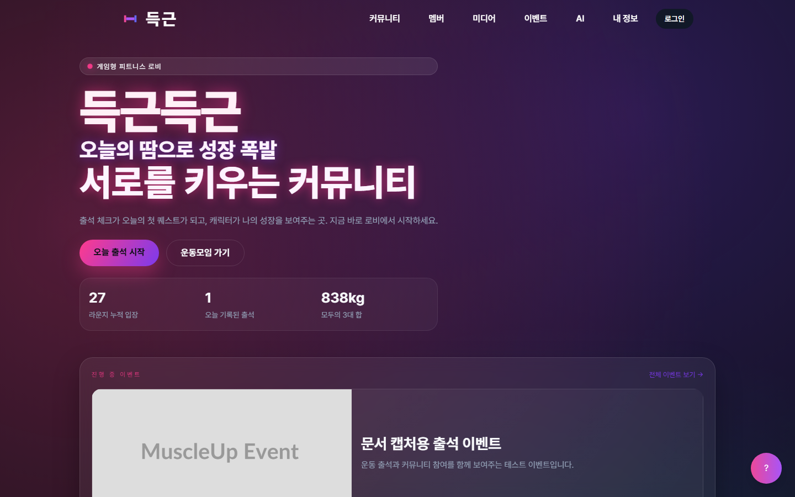

## 2. 서비스 개요
득근득근은 운동 기록을 단순한 메모가 아니라 “출석 → 캐릭터 성장 → 랭킹/라운지/커뮤니티 참여” 흐름으로 확장한 웹 서비스입니다. 사용자는 매일 운동 여부, 운동 유형, 강도, 메모, 사진/영상 기록을 남기고, 마이페이지에서 신체 정보와 3대 운동 수치를 입력해 캐릭터 성장 결과를 확인할 수 있습니다.

서비스는 일반 회원과 관리자 역할을 중심으로 구성되어 있습니다. 일반 회원은 출석 체크, 운동 기록 공유, AI 플래너, 인바디 분석, 자랑방, 단백질 공동구매, 운동 모임, 친구/채팅, 라운지, 이벤트 기능을 사용합니다. 관리자는 대시보드에서 행동 이벤트, 페이지 통계, 프로그램 신청, 콘텐츠, 출석 공유, 문의, 이벤트 CMS를 관리합니다.

득근득근은 운동을 꾸준히 이어가기 어려운 사용자가 매일의 기록을 시각적인 피드백과 커뮤니티 반응으로 확인하게 하고, 관리자는 서비스 활동 데이터를 한 화면에서 관리할 수 있게 하는 데 초점을 둡니다.

## 3. 기존 문제점
- 운동 기록이 메모장, 종이, 기억에 의존하면 지난 운동 흐름을 확인하기 어렵습니다.
- 꾸준함을 유지하기 위한 즉각적인 보상이나 피드백이 부족합니다.
- 신체 스탯, 출석, 3대 운동 수치, 커뮤니티 활동이 분리되어 있으면 성장 과정을 한눈에 보기 어렵습니다.
- 운동 초보자는 자신의 상태에 맞는 반이나 운동 계획을 선택하기 어렵습니다.
- 운동 기록을 함께 공유하고 응원할 공간이 없으면 지속 동기가 약해집니다.
- 관리자는 프로그램 신청, 문의, 이벤트, 콘텐츠, 출석 공유를 여러 곳에서 따로 관리해야 합니다.

## 4. 득근득근의 해결 방식
| 문제 | 득근득근의 해결 방식 | 기대 효과 |
|---|---|---|
| 운동 지속성이 낮음 | 출석 체크, 연속 출석, 월간 캘린더, EXP 보상 흐름 제공 | 매일 운동을 확인하고 이어갈 이유를 제공 |
| 성장 확인이 어려움 | 신체 스탯과 3대 운동 수치를 캐릭터 레벨, 티어, 진화 단계로 반영 | 숫자 기록이 시각적 성장 피드백으로 전환 |
| 운동 계획 선택이 어려움 | AI 체성 분석, 맞춤 루틴 제안, 인바디 사진/PDF 분석, 반 추천 설문 제공 | 초보자도 현재 상태에 맞는 방향을 잡기 쉬움 |
| 혼자 운동하면 동기 유지가 어려움 | 자랑방, 친구/채팅, 라운지, 운동 모임, 챌린지 제공 | 기록 공유와 응원으로 운동 참여를 강화 |
| 운영 데이터가 흩어짐 | 관리자 대시보드, 감사 로그, 프로그램 신청, 문의, 이벤트 CMS 제공 | 관리자가 서비스 상태와 사용자 활동을 빠르게 파악 |

## 5. 주요 사용자
| 역할 | 이 사용자는 누구인가 | 할 수 있는 일 | 얻는 가치 | 관련 화면 |
|---|---|---|---|---|
| 비회원 방문자 | 서비스를 처음 접속한 사용자 | 홈, 로그인, 회원가입, 프로그램, 이벤트 공개 화면 확인 | 서비스 성격과 참여 흐름을 파악 | 홈, 로그인, 회원가입, 프로그램, 이벤트 |
| 일반 회원 | 운동 기록과 커뮤니티 기능을 사용하는 가입 사용자 | 출석 기록, 스탯 입력, AI 상담, 자랑방, 공동구매, 모임, 친구/채팅, 라운지 이용 | 운동 기록과 성장을 한 곳에서 관리 | 출석 체크, 마이페이지, AI, 자랑방, 모임 |
| 관리자 | 서비스 운영 권한이 있는 사용자 | 통계 확인, 프로그램 신청 상태 변경, 콘텐츠 삭제, 출석 공유 숨김, 문의 처리, 이벤트 관리 | 운영 데이터를 한 곳에서 점검하고 조치 | 관리자 대시보드, 이벤트 관리, 이력 보기 |

프로젝트에는 별도의 트레이너/코치/스태프 전용 역할 화면이 구현되어 있지 않습니다. 따라서 문서에서는 실제 코드에 존재하는 비회원, 일반 회원, 관리자 역할만 다룹니다.

## 6. 주요 기능
### 회원가입과 로그인
- 목적: 사용자가 계정을 만들고 인증된 세션으로 보호 기능에 접근합니다.
- 사용 대상: 비회원 방문자, 일반 회원, 관리자
- 주요 흐름: 회원가입 화면에서 이름, 닉네임, 이메일, 이메일 인증 코드, 비밀번호를 입력합니다. 로그인 화면은 Google 로그인 중심으로 구성되어 있으며, 로컬 실행 환경에서 Google Client ID가 없으면 설정 필요 문구가 표시됩니다.
- 기대 효과: 인증된 사용자만 출석, 마이페이지, AI, 커뮤니티, 모임 기능을 사용할 수 있습니다.
- 관련 화면: 로그인, 회원가입

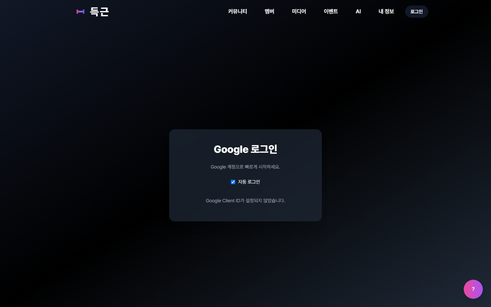

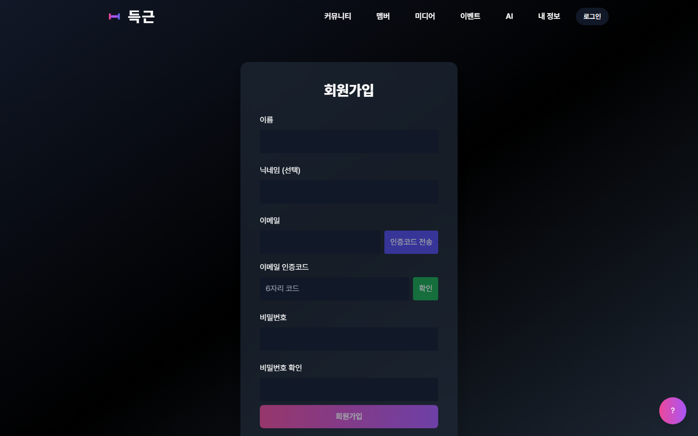

### 출석 체크와 운동 기록
- 목적: 사용자가 오늘의 운동 여부, 운동 유형, 강도, 메모, 미디어를 기록합니다.
- 사용 대상: 일반 회원
- 주요 흐름: 출석 화면에서 월간 캘린더를 확인하고 오늘 운동/휴식 여부를 선택합니다. 운동 유형, 강도, 메모, 사진/영상 첨부를 입력한 뒤 저장합니다. 저장된 기록은 공유 링크로 전환할 수 있습니다.
- 기대 효과: 운동 습관을 날짜별로 확인하고, 연속 출석과 월간 요약을 통해 지속성을 관리합니다.
- 관련 화면: 출석 체크

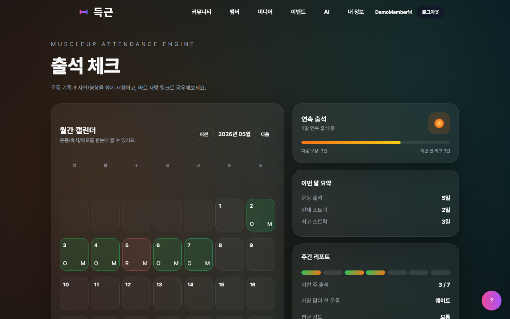

### 마이페이지와 캐릭터 성장
- 목적: 신체 정보와 3대 운동 수치를 입력하고 캐릭터 성장 결과를 확인합니다.
- 사용 대상: 일반 회원
- 주요 흐름: 키, 성별, 몸무게, 골격근량, 체지방률, MBTI, 벤치프레스, 스쿼트, 데드리프트 수치를 입력합니다. 저장 후 캐릭터 레벨, 티어, 진화 단계, 랭킹 정보를 확인합니다.
- 기대 효과: 운동 데이터가 캐릭터 성장, 공개 랭킹, 커스텀 해금 조건으로 연결되어 성취감을 제공합니다.
- 관련 화면: 마이페이지, 랭킹

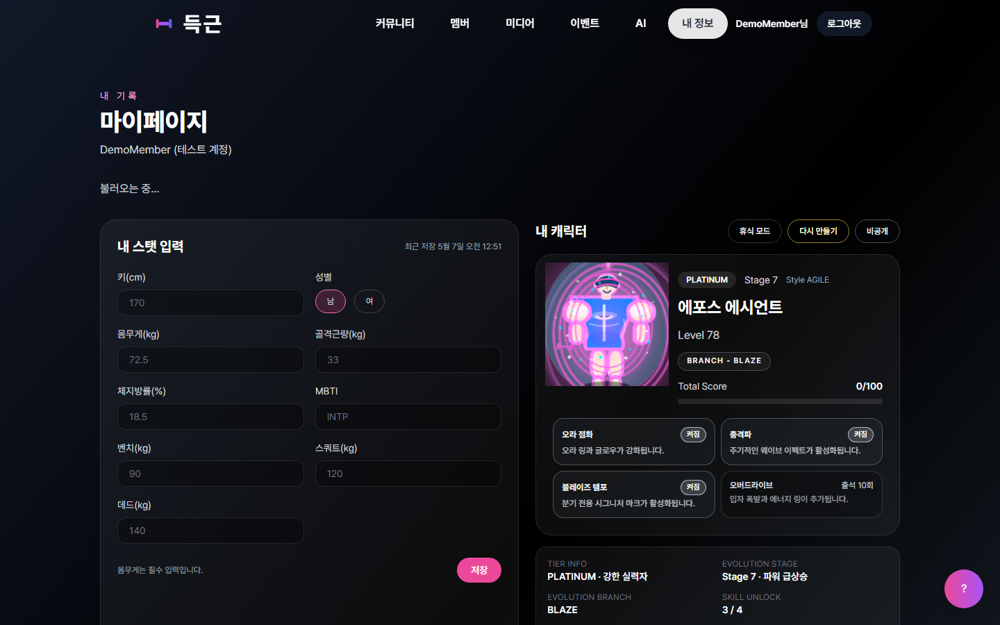

### AI 피트니스 기능
- 목적: 사용자의 신체 정보와 목표를 기반으로 AI 분석, 루틴 제안, 상담 기록을 제공합니다.
- 사용 대상: 일반 회원
- 주요 흐름: AI 화면에서 체성 분석 정보를 입력해 분석 리포트를 받거나, 주간 가능 횟수와 목표를 입력해 맞춤 루틴을 요청합니다. AI 상담은 대화 기록으로 저장되고 공유 링크 생성 기능도 구현되어 있습니다. 인바디 화면에서는 이미지/PDF 기반 상담 흐름이 제공됩니다.
- 기대 효과: 사용자가 자신의 운동 방향을 정리하고 반복 상담 기록을 다시 확인할 수 있습니다.
- 관련 화면: AI 플래너, 인바디 분석

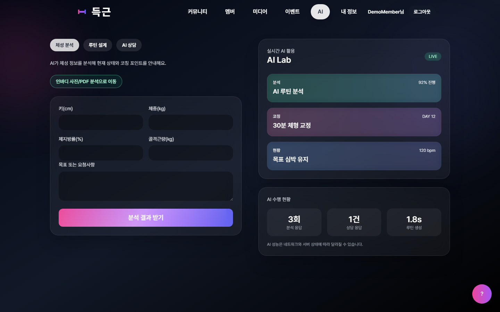

### 커뮤니티와 운동 자랑방
- 목적: 운동 성과와 일상 운동 기록을 게시글로 공유합니다.
- 사용 대상: 일반 회원
- 주요 흐름: 자랑방에서 게시글 목록을 보고, 글쓰기 화면에서 제목, 운동 종목, 중량, 내용, 공개 범위를 입력합니다. 상세 화면에서는 댓글, 좋아요, 수정/삭제 흐름이 구현되어 있습니다.
- 기대 효과: 운동 기록을 커뮤니티 반응과 연결해 지속 동기를 높입니다.
- 관련 화면: 운동 자랑방, 자랑 글쓰기

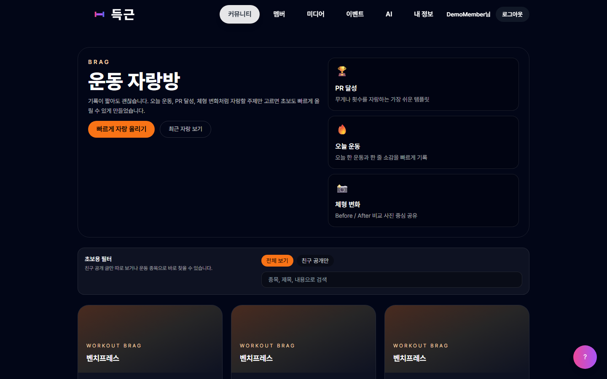

### 단백질 공동구매와 리뷰
- 목적: 단백질 제품 공동구매 모집과 제품 리뷰를 관리합니다.
- 사용 대상: 일반 회원, 관리자
- 주요 흐름: 회원은 공동구매 모집글을 확인하고 등록할 수 있습니다. 상세 화면에서는 참여 신청, 참여자 목록, 채팅 흐름이 구현되어 있습니다. 리뷰 화면에서는 제품별 평점과 후기를 등록/조회할 수 있습니다. 관리자는 공동구매 글을 삭제할 수 있습니다.
- 기대 효과: 운동 커뮤니티 안에서 보충제 구매와 사용 경험을 함께 공유합니다.
- 관련 화면: 단백질 공동구매, 단백질 리뷰

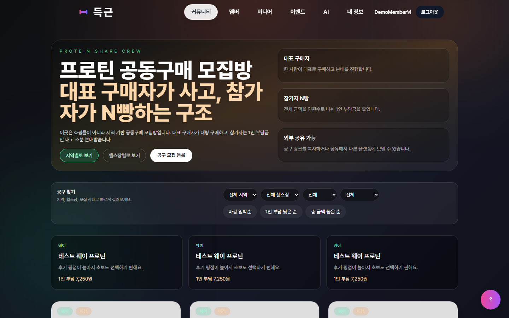

### 운동 모임과 챌린지
- 목적: 회원이 운동 모임을 만들고 참여하며 챌린지 목표를 관리합니다.
- 사용 대상: 일반 회원
- 주요 흐름: 운동 모임 허브에서 새 모임을 만들거나 초대 코드로 참여합니다. 모임별 챌린지, 로비, 하이라이트 화면으로 이동할 수 있고, 모임장은 가입 요청 승인, 멤버 추방, 챌린지 생성/수정/삭제를 할 수 있습니다.
- 기대 효과: 개인 운동 기록을 모임 단위의 참여와 경쟁으로 확장합니다.
- 관련 화면: 운동 모임, 모임 챌린지, 모임 로비

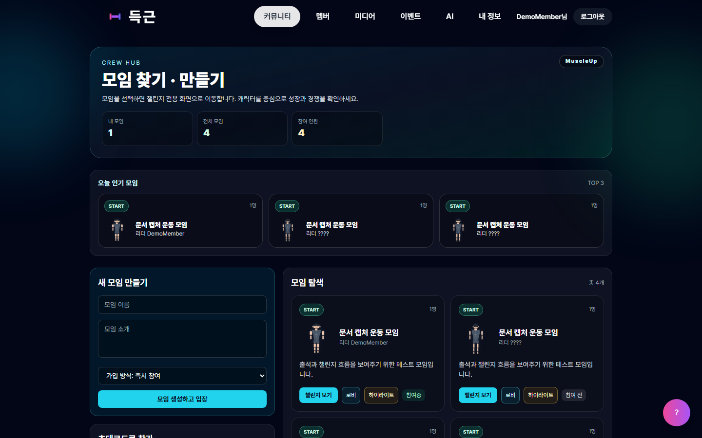

### 친구, 채팅, 실시간 라운지
- 목적: 회원 간 관계와 실시간 접속 경험을 제공합니다.
- 사용 대상: 일반 회원
- 주요 흐름: 친구 화면에서 이메일로 친구 요청을 보내고, 받은 요청을 수락/거절합니다. 친구 채팅방에서 메시지를 주고받을 수 있습니다. 라운지는 Socket.IO 기반으로 캐릭터 위치, 접속자, 채팅, 감정표현을 실시간 동기화합니다.
- 기대 효과: 운동 기록 중심 서비스에 실시간 커뮤니티 경험을 더합니다.
- 관련 화면: 친구/채팅, 라운지

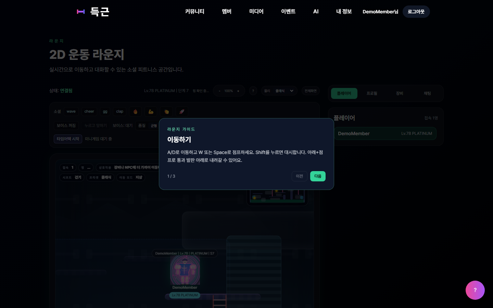

### 프로그램 추천과 신청
- 목적: 운동 상태 설문을 통해 적합한 반을 추천하고 신청까지 연결합니다.
- 사용 대상: 비회원 방문자, 일반 회원
- 주요 흐름: 프로그램 화면에서 반 소개를 확인하고 6문항 설문에 답하면 추천 반과 이유가 표시됩니다. 신청 영역에서 이름, 이메일, 목표, 선택 반, 참여 의지를 제출합니다.
- 기대 효과: 사용자가 현재 운동 상태에 맞는 참여 방향을 선택할 수 있습니다.
- 관련 화면: 프로그램

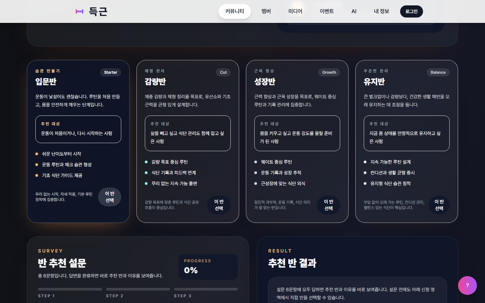

### 이벤트와 관리자 CMS
- 목적: 공개 이벤트를 노출하고 관리자가 이벤트 콘텐츠를 생성/수정/노출 제어합니다.
- 사용 대상: 비회원 방문자, 일반 회원, 관리자
- 주요 흐름: 공개 이벤트 목록/상세 화면에서 이벤트를 확인합니다. 관리자는 이벤트 관리 화면에서 제목, 요약, 본문, 이미지 URL, 기간, 상태, 메인 배너, 고정 여부, 우선순위, CTA, 태그를 관리합니다.
- 기대 효과: 관리자는 서비스 내 캠페인과 공지를 직접 관리할 수 있습니다.
- 관련 화면: 이벤트, 관리자 이벤트 관리

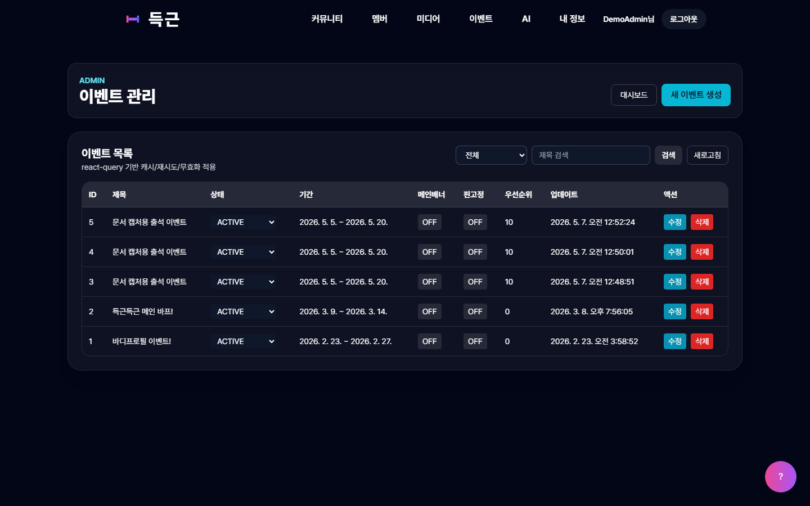

### 관리자 대시보드
- 목적: 운영 데이터, 콘텐츠, 프로그램 신청, 출석 공유, 문의, 감사 로그를 관리합니다.
- 사용 대상: 관리자
- 주요 흐름: 관리자 로그인 후 대시보드에서 30일 행동/페이지 통계, 백엔드 상태, 프로그램 신청 목록, 갤러리/공동구매/자랑글 관리, 출석 기록, 문의 상태 변경, 운영 자동화 작업, 감사 로그를 확인합니다.
- 기대 효과: 관리자가 사용자 활동과 콘텐츠 상태를 한 화면에서 확인하고 필요한 조치를 수행합니다.
- 관련 화면: 관리자 대시보드, 이력 보기

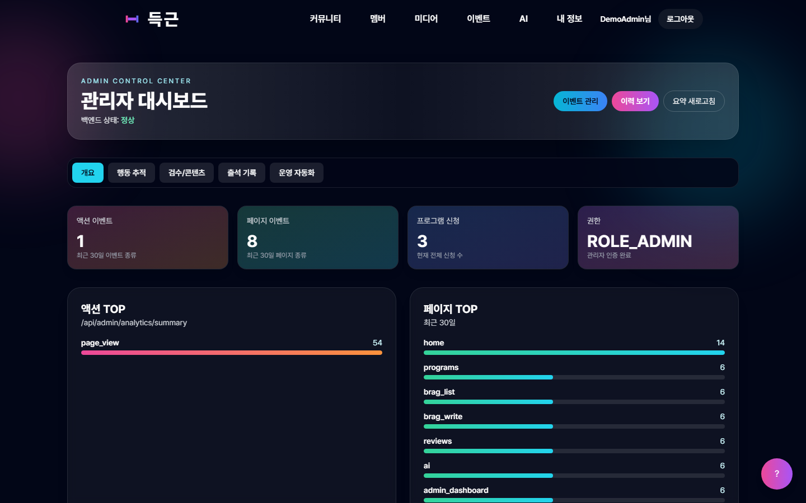

## 7. 사용자별 가치
| 사용자 | 주요 니즈 | 득근득근 제공 가치 |
|---|---|---|
| 비회원 방문자 | 서비스 이해, 프로그램/이벤트 확인, 가입 | 홈, 프로그램, 이벤트 화면을 통해 서비스 흐름을 빠르게 파악 |
| 일반 회원 | 운동 기록, 성장 확인, 커뮤니티 참여 | 출석 기록, 캐릭터 성장, AI 상담, 자랑방, 공동구매, 모임, 친구 기능을 한 곳에서 사용 |
| 관리자 | 운영 현황 파악과 콘텐츠 관리 | 통계, 감사 로그, 신청, 문의, 이벤트 CMS, 콘텐츠 삭제/숨김 기능 제공 |

## 8. 서비스 이용 흐름
일반 회원:
1. 서비스 접속
2. 회원가입 또는 Google 로그인
3. 출석 체크에서 오늘 운동/휴식 기록 저장
4. 마이페이지에서 신체 스탯과 3대 운동 수치 입력
5. 캐릭터 성장, 랭킹, 출석 요약 확인
6. AI 분석/루틴/상담 또는 인바디 분석 사용
7. 자랑방, 공동구매, 리뷰, 운동 모임, 친구/채팅, 라운지 이용
8. 필요 시 출석 공유 링크 또는 AI 상담 공유 링크 생성

관리자:
1. 관리자 계정으로 로그인
2. 관리자 대시보드에서 백엔드 상태와 활동 통계 확인
3. 프로그램 신청 상태 변경
4. 갤러리, 공동구매, 자랑글, 출석 공유 콘텐츠 점검
5. 문의 상태와 관리자 메모 처리
6. 이벤트 CMS에서 공개 이벤트 생성/수정/노출 설정
7. 감사 로그와 운영 자동화 이력 확인

## 9. 시스템 구성 또는 기술적 특징
| 구분 | 실제 구현 내용 |
|---|---|
| 프론트엔드 | React 19, TypeScript, Vite, React Router, TanStack React Query, Axios/Fetch, Tailwind CSS, Recharts, Socket.IO Client, Vite PWA |
| 백엔드 | Java 17, Spring Boot 3.5, Spring Security, Spring Data JPA, Gradle |
| 실시간 서버 | Node.js, TypeScript, Socket.IO, `realtime` 서버 |
| DB | MySQL 또는 PostgreSQL 설정을 지원하는 JPA 구조. 로컬 테스트는 MySQL로 실행 확인 |
| 인증 | JWT access/refresh token, HTTP-only 쿠키, 프론트엔드 localStorage 토큰 보조 사용 |
| 권한 | `ROLE_USER`, `ROLE_ADMIN` 중심. 보호 라우트와 관리자 라우트 분리 |
| 파일 | 로컬 업로드와 S3 업로드를 모두 고려한 파일 API 구현 |
| 외부 연동 | Google 로그인, SMTP 이메일 인증, OpenAI 기반 AI 분석/상담, S3 선택 연동 |
| 주요 API | `/api/auth`, `/api/users`, `/api/attendance`, `/api/character`, `/api/mypage`, `/api/ai`, `/api/brags`, `/api/proteins`, `/api/reviews`, `/api/crew`, `/api/friends`, `/api/events`, `/api/files`, `/api/support`, `/api/admin` |

주요 DB 엔티티는 `User`, `RefreshToken`, `EmailVerification`, `AttendanceLog`, `CharacterProfile`, `UserBodyStats`, `CharacterEvolutionHistory`, `AiChatMessage`, `BragPost`, `BragComment`, `BragLike`, `Protein`, `ProteinShareApplication`, `ProteinShareMessage`, `Review`, `WorkoutCrew`, `WorkoutCrewMember`, `WorkoutCrewJoinRequest`, `CrewChallenge`, `FriendRequest`, `Friendship`, `FriendChatRoom`, `FriendChatMessage`, `CmsEvent`, `Event`, `EventParticipant`, `ProgramApplication`, `Inquiry`, `AnalyticsEvent`, `AuditLog`, `LoungeVisitLog` 등입니다.

## 10. 차별점
- 운동 출석과 캐릭터 성장을 연결해 기록을 즉각적인 시각 피드백으로 바꿉니다.
- 신체 스탯, 3대 운동 수치, 출석, 랭킹, 캐릭터 커스텀 해금을 한 흐름으로 제공합니다.
- AI 분석, 맞춤 루틴, AI 상담 기록, 인바디 이미지/PDF 분석을 별도 화면으로 제공합니다.
- 운동 자랑방, 공동구매, 리뷰, 친구/채팅, 운동 모임, 실시간 라운지를 함께 제공해 커뮤니티성이 강합니다.
- 관리자 대시보드가 실제 운영 기능까지 포함합니다. 단순 조회가 아니라 신청 상태 변경, 콘텐츠 삭제, 출석 공유 숨김, 문의 처리, 이벤트 CMS까지 구현되어 있습니다.

## 11. 기대 효과
- 사용자의 운동 기록 지속성과 참여 동기를 높입니다.
- 운동 초보자가 기록, 분석, 추천, 커뮤니티를 한 서비스 안에서 경험할 수 있습니다.
- 신체 정보와 운동 기록이 캐릭터 성장 및 랭킹으로 연결되어 성취감을 제공합니다.
- 회원 간 응원, 자랑, 친구/채팅, 모임 참여를 통해 혼자 운동하는 부담을 낮춥니다.
- 관리자는 활동 지표, 신청, 문의, 콘텐츠, 이벤트를 한 화면에서 관리해 운영 효율을 높일 수 있습니다.

## 12. 마무리 요약
득근득근은 운동을 단순히 입력하는 기록장이 아니라, 매일의 운동을 출석과 성장, AI 코칭, 커뮤니티 반응, 운영 데이터로 연결하는 게임형 피트니스 플랫폼입니다. 사용자는 자신의 운동 과정을 더 쉽게 이해하고 꾸준히 이어갈 수 있으며, 관리자는 실제 서비스 운영에 필요한 데이터를 체계적으로 관리할 수 있습니다.
