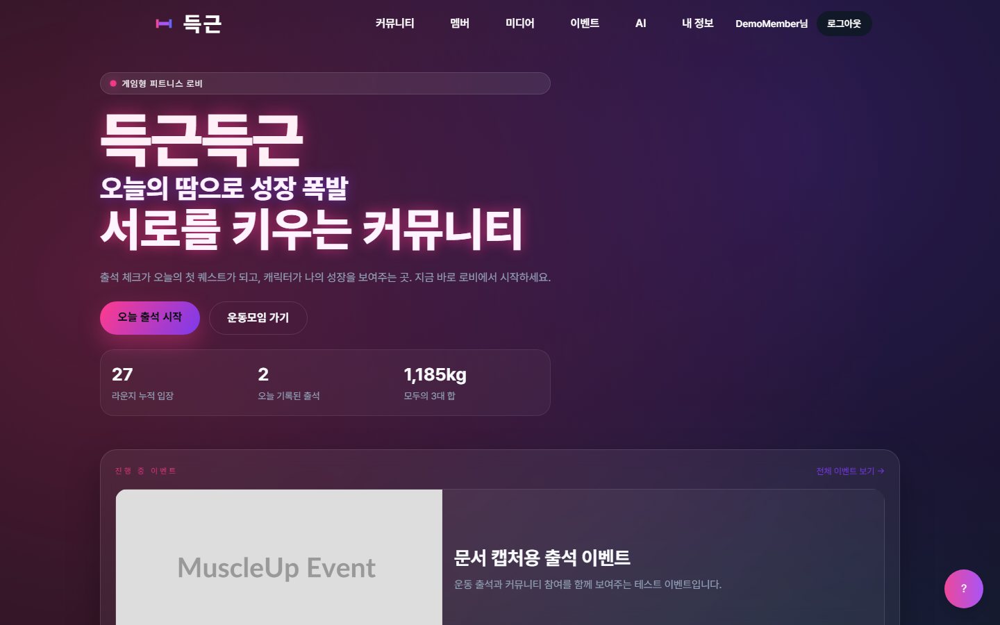
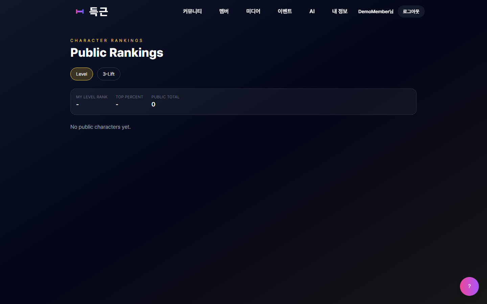
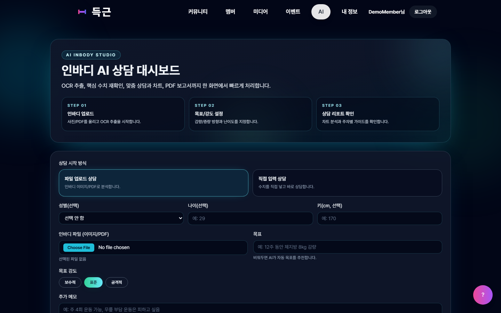
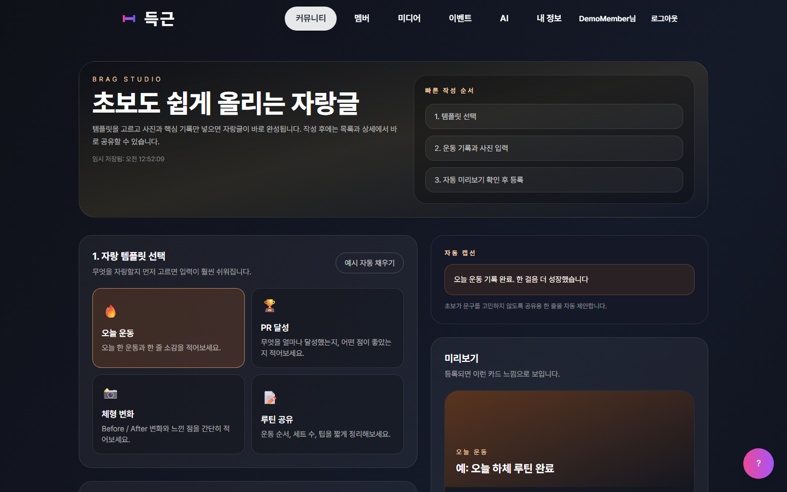
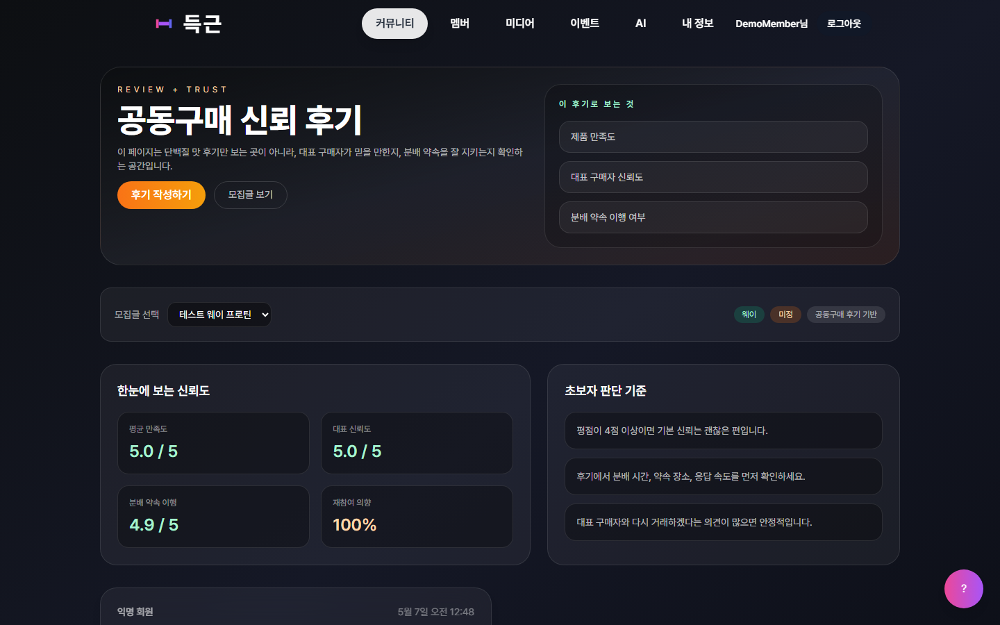
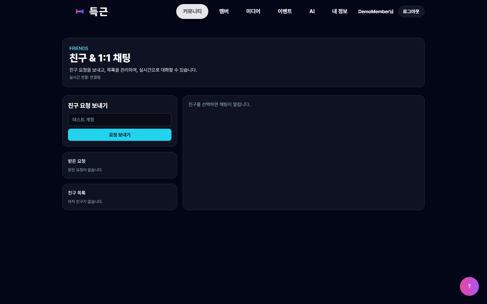
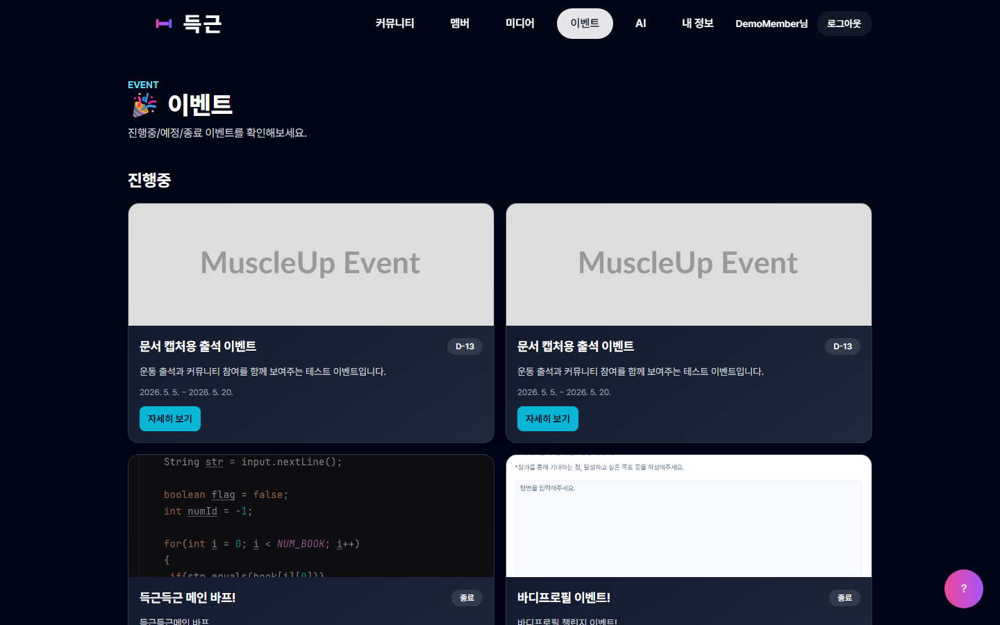
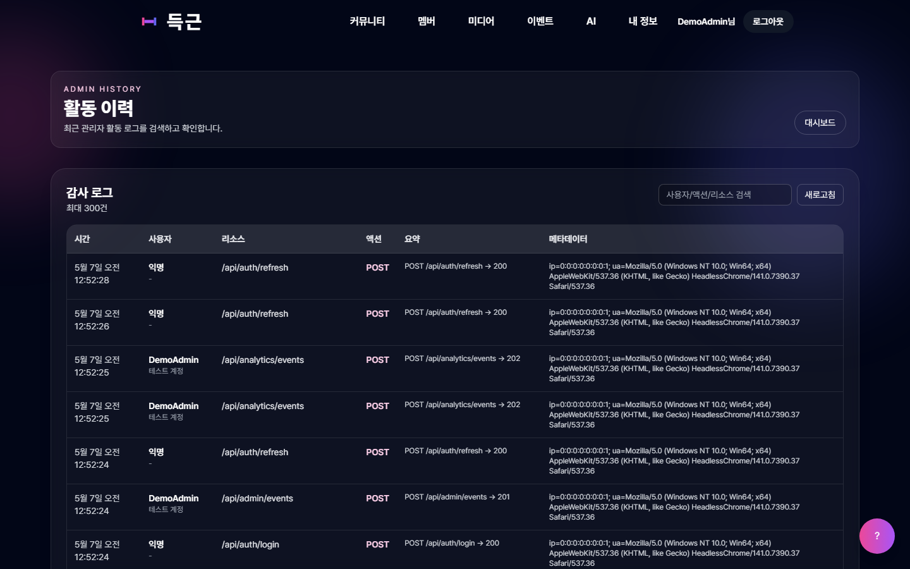

# 득근득근 초보자용 기술 완전 설명서

이 문서는 득근득근 프로젝트를 처음 보는 사람도 기술 구조를 이해할 수 있도록 작성한 설명서입니다. 개발을 막 배우는 사람, 발표 심사자, 프로젝트 인수자가 “화면에서 보이는 기능이 내부 코드와 DB에서 어떻게 움직이는지” 따라갈 수 있도록 최대한 쉬운 말로 정리했습니다.


## 1. 이 문서는 누구를 위한 문서인가

이 문서는 다음 사람을 위해 작성했습니다.

| 대상 | 이 문서에서 얻을 수 있는 것 |
|---|---|
| 개발 초보자 | 프론트엔드, 백엔드, DB, API, 인증이 각각 무슨 일을 하는지 이해할 수 있습니다. |
| 발표 심사자 | 득근득근이 단순 화면이 아니라 서버, DB, 권한, 관리자 기능을 갖춘 서비스라는 점을 확인할 수 있습니다. |
| 프로젝트 인수자 | 어느 폴더와 파일을 보면 어떤 기능을 이해할 수 있는지 빠르게 파악할 수 있습니다. |
| 유지보수 담당자 | 기능별로 화면, API, 서비스, 엔티티가 어떻게 연결되는지 확인할 수 있습니다. |

이 문서는 실제 코드에서 확인한 내용만 설명합니다. 별도 트레이너/코치 역할, 전통적인 운동 루틴 CRUD, 결제 기능처럼 코드에서 전용 화면이나 흐름을 확인하지 못한 기능은 구현 기능처럼 설명하지 않습니다.

## 2. 득근득근을 기술적으로 한 문장으로 말하면

득근득근은 React 프론트엔드, Spring Boot 백엔드, 관계형 DB, JWT 인증, Socket.IO 실시간 서버를 조합해 사용자의 운동 출석, 캐릭터 성장, AI 운동 상담, 커뮤니티, 공동구매, 크루, 친구, 이벤트, 관리자 운영 기능을 제공하는 웹 서비스입니다.

쉽게 말하면 다음 네 부분이 함께 움직입니다.

| 부분 | 쉬운 설명 | 실제 프로젝트 위치 |
|---|---|---|
| 프론트엔드 | 사용자가 보는 화면 | `frontend/` |
| 백엔드 | 화면의 요청을 처리하는 서버 | `backend/` |
| DB | 사용자와 서비스 데이터를 저장하는 곳 | Spring Data JPA 엔티티와 DB |
| 실시간 서버 | 라운지와 친구 채팅처럼 즉시 주고받는 기능 | `realtime/` |

## 3. 전체 구조를 먼저 그림으로 이해하기

웹 서비스는 보통 “화면만 있는 것”이 아닙니다. 사용자가 보는 화면 뒤에는 서버와 DB가 있습니다.

```text
사용자 브라우저
  |
  | 1. 화면 접속, 버튼 클릭, 입력
  v
React 프론트엔드
  |
  | 2. /api/... 주소로 데이터 요청
  v
Spring Boot 백엔드
  |
  | 3. 권한 확인, 비즈니스 로직 처리
  v
DB
  |
  | 4. 사용자, 출석, 게시글, 이벤트 등 저장/조회
  v
Spring Boot 백엔드
  |
  | 5. JSON 응답 반환
  v
React 프론트엔드
  |
  | 6. 응답을 화면에 표시
  v
사용자 브라우저
```

실시간 라운지는 조금 다릅니다. 일반 API는 “요청하고 응답받는 방식”이지만, 실시간 기능은 Socket.IO 연결을 열어 두고 서버가 즉시 이벤트를 보내는 방식입니다.

```text
브라우저 라운지 화면
  <==== Socket.IO 연결 유지 ====>
realtime 서버

사용자가 이동함 -> player:move 이벤트 전송
다른 사용자가 채팅함 -> chat:message 이벤트 수신
다른 사용자가 이모트 사용 -> social:emote 이벤트 수신
```

## 4. 프로젝트 폴더 구조

득근득근 저장소는 크게 네 영역으로 나눌 수 있습니다.

| 폴더/파일 | 역할 |
|---|---|
| `frontend/` | React, Vite, TypeScript 기반 화면 코드가 들어 있습니다. |
| `backend/` | Java 17, Spring Boot 기반 API 서버 코드가 들어 있습니다. |
| `realtime/` | Node.js, Socket.IO 기반 실시간 라운지 서버 코드가 들어 있습니다. |
| `docs/` | 제출용 문서, 사용 설명서, 화면 캡처, 문서 생성 스크립트가 들어 있습니다. |
| `README.md` | 프로젝트 개요와 실행 관련 안내가 들어 있습니다. |

처음 코드를 보는 사람은 다음 순서로 보면 이해하기 쉽습니다.

1. `frontend/src/App.tsx`: 어떤 화면 주소가 있는지 확인합니다.
2. `frontend/src/pages/`: 실제 화면 컴포넌트를 확인합니다.
3. `backend/src/main/java/com/ajou/muscleup/controller/`: 화면이 호출하는 API를 확인합니다.
4. `backend/src/main/java/com/ajou/muscleup/service/`: API가 실제로 어떤 일을 하는지 확인합니다.
5. `backend/src/main/java/com/ajou/muscleup/entity/`: DB에 어떤 데이터가 저장되는지 확인합니다.
6. `realtime/src/server.ts`: 실시간 라운지와 친구 실시간 이벤트를 확인합니다.

## 5. 기술 스택 한눈에 보기

| 영역 | 사용 기술 | 왜 필요한가 |
|---|---|---|
| 프론트엔드 | React 19 | 화면을 컴포넌트 단위로 만들기 위해 사용합니다. |
| 프론트엔드 빌드 | Vite | 개발 서버와 빌드를 빠르게 실행하기 위해 사용합니다. |
| 언어 | TypeScript | 화면 코드에서 데이터 타입을 더 안전하게 다루기 위해 사용합니다. |
| 라우팅 | React Router | `/login`, `/mypage`, `/admin`처럼 주소별 화면을 연결합니다. |
| 서버 상태 | TanStack Query | 관리자 화면 등에서 API 데이터를 캐싱하고 새로고침하기 위해 사용합니다. |
| HTTP 통신 | Axios, Fetch | 프론트엔드가 백엔드 API를 호출할 때 사용합니다. |
| 스타일 | Tailwind CSS, CSS 파일 | 화면 디자인과 반응형 레이아웃을 구성합니다. |
| 차트 | Recharts | 통계성 데이터를 시각화할 때 사용합니다. |
| PWA | vite-plugin-pwa | 서비스 워커와 앱 업데이트 알림을 지원합니다. |
| 백엔드 | Spring Boot 3.5.5 | API 서버, 인증, DB 연동을 구현합니다. |
| 언어 | Java 17 | 백엔드 서버 코드를 작성합니다. |
| DB 접근 | Spring Data JPA | Java 엔티티를 DB 테이블과 연결합니다. |
| 보안 | Spring Security | 로그인 여부와 관리자 권한을 검사합니다. |
| 인증 토큰 | JWT | 로그인 상태를 서버와 브라우저가 안전하게 확인합니다. |
| DB | MySQL 또는 PostgreSQL | 로컬은 MySQL, 운영 설정은 PostgreSQL도 사용할 수 있게 되어 있습니다. |
| 파일 처리 | 로컬 업로드, S3 설정 | 이미지/파일 업로드와 프록시 조회를 처리합니다. |
| AI | OpenAI 연동 구조 | 운동 분석, 루틴 제안, 인바디 상담에 사용됩니다. |
| PDF | Apache PDFBox, jsPDF | 인바디 PDF 읽기와 프론트엔드 PDF 출력에 사용됩니다. |
| 실시간 | Socket.IO | 라운지 위치 동기화, 채팅, 이모트, 음성 조각 전송에 사용됩니다. |

## 6. 프론트엔드는 무엇을 하나

프론트엔드는 사용자가 직접 보는 화면입니다. 사용자가 버튼을 누르고, 글을 입력하고, 메뉴를 이동하는 모든 부분이 프론트엔드에서 시작됩니다.

득근득근의 프론트엔드는 `frontend/src/App.tsx`에서 전체 화면 주소를 관리합니다. 예를 들어 `/attendance` 주소로 들어가면 출석 화면이 열리고, `/admin` 주소로 들어가면 관리자 대시보드가 열립니다.

프론트엔드가 하는 일은 크게 네 가지입니다.

| 역할 | 설명 |
|---|---|
| 화면 표시 | 홈, 로그인, 마이페이지, 출석, AI, 게시판, 관리자 화면을 보여줍니다. |
| 사용자 입력 수집 | 회원가입 정보, 출석 메모, 게시글 내용, AI 상담 입력 등을 받습니다. |
| API 호출 | 입력한 내용을 백엔드로 보내고, 백엔드가 준 데이터를 받아옵니다. |
| 상태 관리 | 로그인 사용자 정보, 로딩 상태, 오류 메시지, API 응답 데이터를 관리합니다. |

## 7. 프론트엔드 주요 파일

| 파일 | 초보자용 설명 |
|---|---|
| `frontend/src/main.tsx` | React 앱을 실제 HTML 화면에 붙이는 시작점입니다. 인증 fetch 설치와 PWA 업데이트 처리도 여기서 시작합니다. |
| `frontend/src/App.tsx` | 전체 라우트 표입니다. 어떤 주소가 어떤 화면을 보여주는지 이 파일에 모여 있습니다. |
| `frontend/src/layouts/Header.tsx` | 상단 메뉴입니다. 로그인 상태와 관리자 여부에 따라 보이는 메뉴가 달라집니다. |
| `frontend/src/components/ProtectedRoute.tsx` | 로그인한 사용자만 들어갈 수 있는 화면을 보호합니다. |
| `frontend/src/components/AdminRoute.tsx` | 관리자만 들어갈 수 있는 화면을 보호합니다. |
| `frontend/src/lib/api.ts` | Axios API 클라이언트입니다. Access Token을 요청 헤더에 붙이고 401 응답 시 토큰 갱신을 시도합니다. |
| `frontend/src/lib/installFetchAuth.ts` | Fetch 요청에도 인증 토큰을 자동으로 붙이도록 브라우저 fetch를 감쌉니다. |
| `frontend/src/services/adminApi.ts` | 관리자 화면에서 호출하는 API 함수들이 모여 있습니다. |
| `frontend/src/services/eventApi.ts` | 이벤트 화면에서 호출하는 API 함수들이 모여 있습니다. |
| `frontend/src/services/crewApi.ts` | 크루/챌린지 화면에서 호출하는 API 함수들이 모여 있습니다. |
| `frontend/src/services/friendApi.ts` | 친구와 친구 채팅 API 함수들이 모여 있습니다. |

## 8. 프론트엔드 라우트 구조

라우트는 “주소와 화면의 연결표”입니다. `frontend/src/App.tsx`에 실제 구현된 주요 라우트는 다음과 같습니다.

| 주소 | 화면 | 권한 |
|---|---|---|
| `/` | 홈 | 누구나 접근 |
| `/login` | 로그인 | 누구나 접근 |
| `/register` | 회원가입 | 누구나 접근 |
| `/programs` | 프로그램 목록/신청 | 누구나 접근 |
| `/events` | 이벤트 목록 | 누구나 접근 |
| `/events/:id` | 이벤트 상세 | 누구나 접근 |
| `/members` | 멤버 소개 | 누구나 접근 |
| `/gallery` | 갤러리 | 누구나 접근 |
| `/about` | 소개 | 누구나 접근 |
| `/attendance/share/:slug` | 출석 공유 페이지 | 누구나 접근 |
| `/ai/share/:slug` | AI 상담 공유 페이지 | 누구나 접근 |
| `/mypage` | 마이페이지 | 로그인 필요 |
| `/attendance` | 출석 체크 | 로그인 필요 |
| `/rankings` | 랭킹 | 로그인 필요 |
| `/ai` | AI 맞춤 운동 플래너 | 로그인 필요 |
| `/ai/inbody` | AI 인바디 상담 | 로그인 필요 |
| `/brag` | 운동 자랑 목록 | 로그인 필요 |
| `/brag/write` | 운동 자랑 작성 | 로그인 필요 |
| `/brag/:id` | 운동 자랑 상세 | 로그인 필요 |
| `/protein` | 단백질 공동구매 | 로그인 필요 |
| `/protein/write` | 공동구매 글 작성 | 로그인 필요 |
| `/proteins/:id` | 공동구매 상세 | 화면 라우트는 공개, API 권한은 기능별 적용 |
| `/reviews` | 리뷰 목록 | 로그인 필요 |
| `/reviews/write` | 리뷰 작성 | 로그인 필요 |
| `/crew` | 크루 허브 | 로그인 필요 |
| `/crew/:crewId/challenges` | 크루 챌린지 | 로그인 필요 |
| `/crew/:crewId/lobby` | 크루 로비 | 로그인 필요 |
| `/crew/:crewId/highlights` | 크루 하이라이트 | 로그인 필요 |
| `/friends` | 친구 | 로그인 필요 |
| `/lounge` | 실시간 라운지 | 로그인 필요 |
| `/admin` | 관리자 대시보드 | 관리자 필요 |
| `/admin/events` | 관리자 이벤트 목록 | 관리자 필요 |
| `/admin/events/new` | 관리자 이벤트 생성 | 관리자 필요 |
| `/admin/events/:id/edit` | 관리자 이벤트 수정 | 관리자 필요 |
| `/admin/history` | 관리자 히스토리/감사 로그 | 관리자 필요 |
| `/forbidden` | 권한 없음 안내 | 누구나 접근 |



## 9. 로그인 보호 화면은 어떻게 막는가

로그인이 필요한 화면은 `ProtectedRoute`로 감싸져 있습니다.

초보자 관점에서 보면 `ProtectedRoute`는 문 앞의 경비원입니다.

```text
사용자가 /mypage 접속
  |
  v
ProtectedRoute가 localStorage와 /api/auth/me 확인
  |
  |-- 로그인 정보 있음 -> 마이페이지 표시
  |
  |-- 로그인 정보 없음 -> /login으로 이동
```

관리자 화면은 `AdminRoute`가 한 번 더 검사합니다.

```text
사용자가 /admin 접속
  |
  v
AdminRoute가 localStorage의 role 확인
  |
  |-- ADMIN 또는 ROLE_ADMIN 아님 -> /forbidden으로 이동
  |
  v
/api/auth/me 호출로 서버에서도 관리자 확인
  |
  |-- 관리자 맞음 -> 관리자 화면 표시
  |
  |-- 관리자 아님 -> /forbidden으로 이동
```

이 구조가 중요한 이유는 브라우저 화면에서 메뉴를 숨기는 것만으로는 보안이 충분하지 않기 때문입니다. 득근득근은 프론트엔드 라우트에서 1차로 막고, 백엔드 Spring Security에서 2차로 막습니다.

## 10. 백엔드는 무엇을 하나

백엔드는 화면 뒤에서 실제 데이터를 처리하는 서버입니다.

프론트엔드는 “출석 저장해 주세요”라고 요청할 뿐이고, 백엔드는 다음 일을 합니다.

1. 이 사용자가 로그인했는지 확인합니다.
2. 이 사용자가 해당 기능을 사용할 권한이 있는지 확인합니다.
3. 요청 데이터가 올바른지 확인합니다.
4. DB에서 기존 데이터를 조회합니다.
5. 새 데이터를 저장하거나 수정합니다.
6. 결과를 JSON 형태로 프론트엔드에 돌려줍니다.

득근득근 백엔드는 Spring Boot로 구성되어 있고, 코드는 보통 다음 흐름으로 나뉩니다.

```text
Controller
  |
  | 요청 받기
  v
Service
  |
  | 실제 기능 로직 처리
  v
Repository
  |
  | DB 조회/저장
  v
Entity
  |
  | DB 테이블과 연결되는 데이터 구조
```

## 11. 백엔드 주요 폴더

| 폴더 | 역할 |
|---|---|
| `backend/src/main/java/com/ajou/muscleup/controller/` | API 주소를 정의합니다. 프론트엔드가 호출하는 입구입니다. |
| `backend/src/main/java/com/ajou/muscleup/service/` | 실제 기능 로직이 들어 있습니다. |
| `backend/src/main/java/com/ajou/muscleup/repository/` | DB에 접근하는 코드입니다. |
| `backend/src/main/java/com/ajou/muscleup/entity/` | DB 테이블과 연결되는 Java 클래스입니다. |
| `backend/src/main/java/com/ajou/muscleup/dto/` | API 요청/응답에 사용하는 데이터 모양입니다. |
| `backend/src/main/java/com/ajou/muscleup/config/` | 보안, CORS, JWT, 감사 로그, 스케줄링 같은 설정이 들어 있습니다. |
| `backend/src/main/resources/` | DB, 메일, OAuth, OpenAI, CORS, S3 같은 환경 설정 파일이 들어 있습니다. |

## 12. API는 무엇인가

API는 프론트엔드와 백엔드가 대화하는 약속입니다.

예를 들어 출석 체크 화면에서 저장 버튼을 누르면 프론트엔드는 백엔드에 이런 의미의 요청을 보냅니다.

```text
"이 사용자가 오늘 운동했는지, 어떤 메모를 썼는지 저장해 주세요."
```

백엔드는 요청을 처리한 뒤 이런 의미의 응답을 돌려줍니다.

```text
"저장했습니다. 현재 출석 기록은 이런 상태입니다."
```

실제 웹에서는 사람이 읽는 문장이 아니라 HTTP 주소, 메서드, JSON 데이터로 주고받습니다.

| 개념 | 쉬운 설명 |
|---|---|
| HTTP 메서드 | 무엇을 하려는 요청인지 나타냅니다. GET은 조회, POST는 생성, PUT/PATCH는 수정, DELETE는 삭제에 가깝습니다. |
| URL | 어떤 기능을 호출하는지 나타내는 주소입니다. 예: `/api/attendance/summary` |
| Request Body | 서버로 보내는 입력 데이터입니다. |
| Response Body | 서버가 돌려주는 결과 데이터입니다. |
| Status Code | 성공/실패를 숫자로 알려줍니다. 200은 성공, 401은 로그인 필요, 403은 권한 없음입니다. |

## 13. 주요 API 그룹

득근득근 백엔드 컨트롤러에서 확인한 주요 API 그룹은 다음과 같습니다.

| API 그룹 | 주요 주소 | 담당 기능 |
|---|---|---|
| 인증 | `/api/auth/...` | 이메일 인증, 로그인, 토큰 갱신, 로그아웃, 내 정보 조회, Google 로그인 |
| 회원가입 | `/api/users/register` | 사용자 계정 생성 |
| 출석 | `/api/attendance/...` | 오늘 출석, 출석 목록, 요약, 공유, 응원, 신고, 랭킹 |
| 마이페이지 | `/api/mypage`, `/api/mypage/stats` | 회원 통계와 신체/운동 수치 관리 |
| 캐릭터 | `/api/character/...` | 캐릭터 프로필, 평가, 공개 여부, 휴식 상태, 재생성 |
| 랭킹 | `/api/rankings/characters` | 캐릭터 랭킹 |
| AI | `/api/ai/...` | 체성 분석, 루틴 제안, 상담, 인바디 상담, PDF 리포트, 공유 |
| 운동 자랑 | `/api/brags/...` | 게시글 작성/조회/수정/삭제, 댓글, 좋아요 |
| 단백질 공동구매 | `/api/proteins/...` | 공동구매 글, 신청, 참여 상태, 채팅 |
| 리뷰 | `/api/reviews/...` | 리뷰 작성/조회/수정/삭제 |
| 크루 | `/api/crew/...` | 크루 생성, 가입, 초대코드, 가입 요청, 챌린지 |
| 친구 | `/api/friends/...` | 친구 요청, 수락/거절, 친구 목록, 채팅 메시지 |
| 라운지 | `/api/lounge/profile` | 실시간 라운지에 입장할 때 필요한 사용자 프로필 |
| 이벤트 | `/api/events/...` | 공개 이벤트 목록/상세, 조회/클릭 기록, 활성 이벤트 |
| 파일 | `/api/files/...` | 파일 업로드, 삭제, 프록시, 목록 조회 |
| 고객지원 | `/api/support/...` | 문의 등록, 지원 채팅 |
| 분석 | `/api/analytics/events` | 프론트엔드 행동 이벤트 기록 |
| 관리자 | `/api/admin/...` | 관리자 대시보드, 신청 관리, 출석 공유 관리, 문의 관리, 콘텐츠 삭제, 감사 로그 |
| 관리자 이벤트 | `/api/admin/events/...` | 이벤트 생성, 수정, 삭제, 상태 변경, 배너/고정 설정 |

## 14. DB는 무엇을 저장하는가

DB는 서비스의 기억장치입니다. 사용자가 새로고침해도 출석 기록과 게시글이 남아 있는 이유는 DB에 저장되기 때문입니다.

득근득근은 Spring Data JPA를 사용합니다. JPA에서는 Java 클래스인 `Entity`가 DB 테이블과 연결됩니다.

예를 들어 `User.java`는 사용자 테이블과 연결됩니다.

| Entity | 저장하는 정보 |
|---|---|
| `User` | 이름, 이메일, 비밀번호 해시, 역할, 닉네임, 생성일 |
| `EmailVerification` | 이메일 인증 코드와 인증 상태 |
| `RefreshToken` | 로그인 연장에 쓰는 리프레시 토큰 |
| `UserBodyStats` | 벤치프레스, 스쿼트, 데드리프트 등 사용자의 신체/운동 수치 |
| `AttendanceLog` | 날짜별 운동 여부, 메모, 운동 종류, 강도, 미디어, 공유 상태 |
| `CharacterProfile` | 캐릭터 레벨, 티어, 진화 단계, 공개 여부, 아바타 설정 |
| `CharacterEvolutionHistory` | 캐릭터 성장/진화 이력 |
| `AiChatMessage` | AI 상담 메시지와 공유 정보 |
| `BragPost` | 운동 자랑 게시글 |
| `BragComment` | 운동 자랑 댓글 |
| `BragLike` | 운동 자랑 좋아요 |
| `Protein` | 단백질 공동구매 글 |
| `ProteinShareApplication` | 공동구매 참여 신청 |
| `ProteinShareMessage` | 공동구매 채팅 메시지 |
| `Review` | 공동구매 리뷰 |
| `WorkoutCrew` | 크루 정보 |
| `WorkoutCrewMember` | 크루 멤버 정보 |
| `WorkoutCrewJoinRequest` | 크루 가입 요청 |
| `CrewChallenge` | 크루 챌린지 |
| `FriendRequest` | 친구 요청 |
| `Friendship` | 친구 관계 |
| `FriendChatRoom` | 친구 채팅방 |
| `FriendChatMessage` | 친구 채팅 메시지 |
| `CmsEvent` | 관리자 CMS 이벤트 |
| `Event` | 이벤트 진행 데이터 |
| `EventParticipant` | 이벤트 참여자 |
| `ProgramApplication` | 프로그램 신청 |
| `Inquiry` | 고객지원 문의 |
| `AnalyticsEvent` | 화면 행동 분석 이벤트 |
| `AuditLog` | POST/PUT/PATCH/DELETE 요청 감사 기록 |
| `LoungeVisitLog` | 라운지 방문 기록 |

## 15. 사용자와 권한 구조

현재 코드에서 확인한 주요 서비스 역할은 다음과 같습니다.

| 역할 | DB/토큰 표현 | 할 수 있는 일 |
|---|---|---|
| 비로그인 방문자 | 없음 | 홈, 로그인, 회원가입, 프로그램, 이벤트, 공개 공유 페이지 접근 |
| 일반 회원 | `USER` 또는 `ROLE_USER` | 출석, 마이페이지, AI, 게시글, 공동구매, 크루, 친구, 라운지 사용 |
| 관리자 | `ADMIN` 또는 `ROLE_ADMIN` | 일반 회원 기능 + 관리자 대시보드와 관리자 API 접근 |

코드에서 별도의 트레이너/코치/스태프/운영자 역할은 확인되지 않았습니다. 운영성 기능은 관리자 역할이 담당합니다.

## 16. 인증 구조를 쉬운 말로 이해하기

인증은 “너 누구야?”를 확인하는 과정입니다. 인가는 “너 이 기능 써도 돼?”를 확인하는 과정입니다.

득근득근은 JWT 기반 인증을 사용합니다.

| 용어 | 쉬운 설명 |
|---|---|
| Access Token | 짧은 시간 동안 API 요청에 붙이는 출입증입니다. |
| Refresh Token | Access Token이 만료됐을 때 새 Access Token을 받기 위한 갱신권입니다. |
| Authorization Header | API 요청에 토큰을 붙이는 위치입니다. 예: `Bearer ...` |
| Cookie | 브라우저가 서버와 함께 주고받을 수 있는 저장 공간입니다. |
| localStorage | 프론트엔드가 사용자 정보를 임시 저장하는 브라우저 저장 공간입니다. |

로그인 후 흐름은 다음과 같습니다.

```text
사용자 로그인
  |
  v
백엔드가 사용자 확인
  |
  v
Access Token + Refresh Token 발급
  |
  v
프론트엔드가 localStorage에 사용자 정보 저장
  |
  v
API 호출 때 Authorization: Bearer AccessToken 추가
  |
  v
백엔드 JwtAuthenticationFilter가 토큰 검사
  |
  v
권한이 맞으면 API 실행
```

## 17. 백엔드 보안 설정

`SecurityConfig.java`는 백엔드 보안의 핵심입니다.

이 파일에서 정하는 것은 다음과 같습니다.

| 설정 | 의미 |
|---|---|
| CSRF 비활성화 | JWT 기반 API 서버 형태로 동작하게 합니다. |
| CORS 설정 연결 | 프론트엔드 주소에서 백엔드 API를 호출할 수 있게 합니다. |
| Session Stateless | 서버 세션 대신 토큰으로 로그인 상태를 확인합니다. |
| 공개 API 지정 | 로그인 없이 접근 가능한 API를 정합니다. |
| 회원 API 지정 | `ROLE_USER`, `ROLE_ADMIN`이 접근 가능한 API를 정합니다. |
| 관리자 API 지정 | `ROLE_ADMIN`만 접근 가능한 API를 정합니다. |
| JWT 필터 추가 | 모든 요청 전에 토큰을 검사합니다. |
| 감사 로그 필터 추가 | 변경성 요청을 감사 로그로 남깁니다. |

공개 API 예시는 다음과 같습니다.

| 공개 API | 이유 |
|---|---|
| `/api/auth/**` | 로그인/회원가입/토큰 갱신에 필요합니다. |
| `/api/users/register` | 회원가입에 필요합니다. |
| `/api/programs/apply` | 프로그램 신청은 비로그인 사용자도 가능하게 되어 있습니다. |
| `/api/events`, `/api/events/*` | 이벤트 목록과 상세는 공개 화면입니다. |
| `/api/ai/share/**` | 공유 링크를 받은 사람이 볼 수 있어야 합니다. |
| `/api/attendance/share/**` | 출석 공유 링크를 받은 사람이 볼 수 있어야 합니다. |

관리자 API 예시는 다음과 같습니다.

| 관리자 API | 기능 |
|---|---|
| `/api/admin/analytics/summary` | 관리자 대시보드 요약 |
| `/api/admin/programs/applications` | 프로그램 신청 목록 |
| `/api/admin/attendance/logs` | 출석 로그 목록 |
| `/api/admin/support/inquiries` | 문의 목록 |
| `/api/admin/events/**` | 이벤트 CMS 관리 |
| `/api/admin/audit` | 감사 로그 조회 |

## 18. 프론트엔드 인증 보조 구조

득근득근 프론트엔드는 Axios와 Fetch를 모두 사용합니다. 그래서 인증 토큰을 두 방식 모두에 붙일 수 있도록 두 파일이 존재합니다.

| 파일 | 역할 |
|---|---|
| `frontend/src/lib/api.ts` | Axios 요청에 Access Token을 붙이고, 401 응답이 오면 Refresh Token으로 갱신을 시도합니다. |
| `frontend/src/lib/installFetchAuth.ts` | Fetch 요청에도 Access Token을 붙이고, 401 응답 시 재시도할 수 있게 합니다. |

`main.tsx`에서는 앱 시작 시 다음 작업을 합니다.

1. `installFetchAuth()`를 호출해 fetch 인증 처리를 설치합니다.
2. `bootstrapAuthSession()`으로 기존 로그인 세션을 갱신하려고 시도합니다.
3. React 앱을 화면에 렌더링합니다.
4. PWA 서비스 워커 업데이트 알림을 등록합니다.

## 19. 회원가입과 로그인 흐름

회원가입은 프론트엔드의 `/register` 화면에서 시작됩니다.


기술 흐름은 다음과 같습니다.

```text
/register 화면
  |
  | 이메일 인증 코드 요청
  v
POST /api/auth/email/send-code
  |
  | 인증 코드 확인
  v
POST /api/auth/email/verify
  |
  | 사용자 생성
  v
POST /api/users/register
  |
  v
users 테이블에 사용자 저장
```

로그인은 `/login` 화면에서 시작됩니다.


백엔드에는 `/api/auth/login`과 `/api/auth/google` 흐름이 구현되어 있습니다. 프론트엔드 로그인 화면은 Google 로그인 중심으로 구성되어 있고, 로컬 환경에서 Google Client ID가 없으면 설정 안내 문구가 표시됩니다.

로그인 성공 후 백엔드는 Access Token과 Refresh Token을 발급합니다. 이후 프론트엔드는 API 호출마다 Access Token을 붙입니다.

## 20. 출석 체크 기능의 내부 흐름

출석 체크는 득근득근의 핵심 기능 중 하나입니다. 사용자는 운동 여부, 운동 종류, 강도, 메모, 미디어, 공유 여부를 기록할 수 있습니다.


내부 흐름은 다음과 같습니다.

```text
사용자가 /attendance 화면 접속
  |
  v
프론트엔드가 /api/attendance, /api/attendance/summary 호출
  |
  v
백엔드 AttendanceController
  |
  v
AttendanceService
  |
  v
AttendanceLogRepository
  |
  v
attendance_logs 테이블 조회
```

사용자가 특정 날짜의 출석을 저장하면 다음 흐름이 됩니다.

```text
저장 버튼 클릭
  |
  v
PUT /api/attendance/{date}
  |
  v
JWT로 사용자 확인
  |
  v
기존 날짜 기록이 있으면 수정, 없으면 생성
  |
  v
AttendanceLog 저장
  |
  v
캐릭터 성장/랭킹에 반영 가능한 데이터가 됨
```

출석 공유 기능은 `shareSlug`를 생성해 외부에서도 볼 수 있는 공유 주소를 만듭니다. 공유된 출석은 응원과 신고 카운트도 가질 수 있고, 관리자는 부적절한 공유를 숨길 수 있습니다.

## 21. 마이페이지와 캐릭터 성장 구조

마이페이지는 사용자의 신체/운동 수치, 출석 기반 성장, 캐릭터 상태를 보여주는 화면입니다.


관련 API와 데이터는 다음과 같습니다.

| 화면 요소 | API/Entity | 설명 |
|---|---|---|
| 내 정보 | `/api/auth/me`, `User` | 이메일, 닉네임, 역할 같은 기본 정보를 확인합니다. |
| 운동 수치 | `/api/mypage/stats`, `UserBodyStats` | 벤치프레스, 스쿼트, 데드리프트, 체중 등을 저장합니다. |
| 캐릭터 | `/api/character/me`, `CharacterProfile` | 레벨, 티어, 진화 단계, 공개 여부를 관리합니다. |
| 캐릭터 평가 | `/api/character/evaluate` | 사용자의 기록을 기반으로 캐릭터 상태를 평가합니다. |
| 랭킹 | `/api/rankings/characters` | 공개 캐릭터를 랭킹 화면에 표시합니다. |

캐릭터 성장은 단순히 그림만 보여주는 기능이 아닙니다. 백엔드에는 `CharacterGrowthService`, `CharacterGrowthCalculator`, `CharacterEvolutionHistory`가 있어 캐릭터 프로필과 성장 이력을 관리하는 구조가 있습니다.

## 22. 랭킹 기능 구조

랭킹 화면은 공개 설정된 캐릭터와 출석/성장 관련 데이터를 보여줍니다.



기술적으로는 다음 흐름입니다.

```text
/rankings 화면
  |
  v
GET /api/rankings/characters
  |
  v
RankingController
  |
  v
RankingService
  |
  v
CharacterProfileRepository
  |
  v
공개 캐릭터 목록과 점수 반환
```

이 기능은 일반 회원과 관리자가 접근할 수 있습니다. 비로그인 사용자는 `ProtectedRoute`에 의해 로그인 화면으로 이동합니다.

## 23. AI 맞춤 운동 플래너 구조

AI 화면은 세 가지 큰 흐름을 갖습니다.

| 탭/기능 | 설명 |
|---|---|
| 체성 분석 | 신체 정보와 목표를 입력해 AI 분석 결과를 받습니다. |
| 루틴 설계 | 목표, 주간 운동 가능 횟수, 집중 부위, 장비 등을 입력해 4주 루틴 제안을 받습니다. |
| AI 상담 | 운동/식단 고민을 대화형으로 상담하고 상담 기록을 저장합니다. |


관련 API는 다음과 같습니다.

| API | 기능 |
|---|---|
| `POST /api/ai/analyze` | 체성 분석 |
| `POST /api/ai/plan` | 맞춤 루틴 제안 |
| `POST /api/ai/chat` | AI 상담 |
| `GET /api/ai/chat/history` | 상담 기록 조회 |
| `POST /api/ai/chat/history/{id}/share` | 상담 공유 링크 생성 |
| `DELETE /api/ai/chat/history/{id}/share` | 상담 공유 해제 |
| `GET /api/ai/share/{slug}` | 공유 상담 조회 |

초보자 관점에서 AI 기능은 이렇게 이해하면 됩니다.

```text
사용자가 목표와 몸 상태 입력
  |
  v
프론트엔드가 백엔드 AI API 호출
  |
  v
백엔드가 OpenAI API에 질문 구성
  |
  v
OpenAI 응답 수신
  |
  v
백엔드가 결과를 정리해 프론트엔드에 전달
  |
  v
화면에 분석 결과 표시
```

API Key는 백엔드 환경변수로 관리되어야 하며, 프론트엔드나 문서에 실제 값을 노출하면 안 됩니다.

## 24. 인바디 AI 상담 구조

인바디 상담 화면은 이미지/PDF 업로드 또는 직접 입력으로 상담을 시작할 수 있습니다.



관련 API는 다음과 같습니다.

| API | 기능 |
|---|---|
| `POST /api/ai/inbody/consult` | 인바디 이미지/PDF 기반 상담 |
| `POST /api/ai/inbody/review-consult` | 확정값으로 재상담 |
| `POST /api/ai/inbody/report/pdf` | 상담 결과 PDF 생성 |

이 화면은 단순히 텍스트만 보여주는 기능이 아니라 다음 과정을 포함합니다.

1. 사용자가 인바디 이미지/PDF를 업로드하거나 수치를 직접 입력합니다.
2. 백엔드는 입력값을 상담 요청 데이터로 구성합니다.
3. AI 응답을 받아 요약, 우선순위, 운동 방향, 식단 방향 같은 카드로 나눕니다.
4. 사용자는 오인식된 수치가 있으면 수정 후 재상담할 수 있습니다.
5. 필요하면 PDF 보고서로 저장할 수 있습니다.

## 25. 운동 자랑 게시판 구조

운동 자랑 기능은 운동 기록을 게시글 형태로 공유하는 커뮤니티 기능입니다.


주요 API는 다음과 같습니다.

| API | 기능 |
|---|---|
| `POST /api/brags` | 게시글 작성 |
| `GET /api/brags` | 게시글 목록 |
| `GET /api/brags/{id}` | 게시글 상세 |
| `PUT /api/brags/{id}` | 게시글 수정 |
| `DELETE /api/brags/{id}` | 게시글 삭제 |
| `GET /api/brags/{id}/comments` | 댓글 목록 |
| `POST /api/brags/{id}/comments` | 댓글 작성 |
| `PATCH /api/brags/comments/{commentId}` | 댓글 수정 |
| `DELETE /api/brags/comments/{commentId}` | 댓글 삭제 |
| `POST /api/brags/{id}/like` | 좋아요 토글 |
| `GET /api/brags/{id}/like` | 좋아요 상태 확인 |

게시글 작성 화면에서는 제목, 운동 종목, 중량, 내용, 공개 범위, 미디어를 입력합니다.



관리자는 관리자 API를 통해 부적절한 게시글이나 댓글을 삭제할 수 있습니다.

## 26. 단백질 공동구매와 리뷰 구조

단백질 공동구매 화면은 결제 기능이 아니라 모집, 신청, 참여 상태, 채팅, 리뷰 중심으로 구현되어 있습니다.


관련 API는 다음과 같습니다.

| API | 기능 |
|---|---|
| `POST /api/proteins` | 공동구매 글 작성 |
| `GET /api/proteins` | 공동구매 목록 조회 |
| `GET /api/proteins/{id}` | 공동구매 상세 조회 |
| `PUT /api/proteins/{id}` | 공동구매 글 수정, 관리자 권한 |
| `DELETE /api/proteins/{id}` | 공동구매 글 삭제, 관리자 권한 |
| `POST /api/proteins/{proteinId}/applications` | 참여 신청 |
| `GET /api/proteins/{proteinId}/applications/me` | 내 신청 상태 |
| `GET /api/proteins/{proteinId}/applications` | 신청 목록 |
| `PATCH /api/proteins/{proteinId}/applications/{appId}` | 신청 상태 변경 |
| `GET /api/proteins/{proteinId}/chat/messages` | 공동구매 채팅 조회 |
| `POST /api/proteins/{proteinId}/chat/messages` | 공동구매 채팅 작성 |

리뷰 화면은 공동구매 이용 후 후기를 남기는 기능입니다.



| API | 기능 |
|---|---|
| `POST /api/reviews` | 리뷰 작성 |
| `GET /api/reviews` | 리뷰 목록 |
| `PATCH /api/reviews/{id}` | 리뷰 수정 |
| `DELETE /api/reviews/{id}` | 리뷰 삭제 |

## 27. 크루와 챌린지 구조

크루는 함께 운동하는 그룹을 만들고 참여하는 기능입니다.


관련 API는 다음과 같습니다.

| API | 기능 |
|---|---|
| `POST /api/crew/groups` | 크루 생성 |
| `GET /api/crew/groups` | 크루 목록 |
| `GET /api/crew/groups/{crewId}` | 크루 상세 |
| `POST /api/crew/groups/{crewId}/join` | 크루 가입 요청 |
| `DELETE /api/crew/groups/{crewId}/leave` | 크루 나가기 |
| `POST /api/crew/groups/join-by-code/{inviteCode}` | 초대 코드로 가입 |
| `GET /api/crew/groups/{crewId}/join-requests` | 가입 요청 목록 |
| `POST /api/crew/groups/{crewId}/join-requests/{requestId}/approve` | 가입 승인 |
| `POST /api/crew/groups/{crewId}/join-requests/{requestId}/reject` | 가입 거절 |
| `PUT /api/crew/groups/{crewId}` | 크루 수정 |
| `DELETE /api/crew/groups/{crewId}` | 크루 삭제 |
| `POST /api/crew/groups/{crewId}/challenges` | 챌린지 생성 |
| `PUT /api/crew/groups/{crewId}/challenges/{challengeId}` | 챌린지 수정 |
| `DELETE /api/crew/groups/{crewId}/challenges/{challengeId}` | 챌린지 삭제 |

크루에는 `WorkoutCrew`, `WorkoutCrewMember`, `WorkoutCrewJoinRequest`, `CrewChallenge` 같은 엔티티가 사용됩니다.

## 28. 친구와 친구 채팅 구조

친구 기능은 친구 요청, 수락/거절, 친구 목록, 1:1 채팅 메시지 조회/작성으로 구성됩니다.



관련 API는 다음과 같습니다.

| API | 기능 |
|---|---|
| `POST /api/friends/requests` | 친구 요청 |
| `GET /api/friends/requests/incoming` | 받은 친구 요청 |
| `GET /api/friends/requests/outgoing` | 보낸 친구 요청 |
| `POST /api/friends/requests/{requestId}/accept` | 친구 요청 수락 |
| `POST /api/friends/requests/{requestId}/reject` | 친구 요청 거절 |
| `GET /api/friends` | 친구 목록 |
| `DELETE /api/friends/{friendId}` | 친구 삭제 |
| `GET /api/friends/chat/rooms` | 친구 채팅방 목록 |
| `GET /api/friends/chat/rooms/{friendId}/messages` | 친구 채팅 메시지 조회 |
| `POST /api/friends/chat/rooms/{friendId}/messages` | 친구 채팅 메시지 저장 |

추가로 실시간 서버에는 `friend:join`, `friend:subscribe`, `friend:send` 이벤트가 구현되어 있습니다. DB 저장은 백엔드 API가 담당하고, 즉시 화면에 알리는 역할은 Socket.IO가 보조합니다.

## 29. 실시간 라운지 구조

라운지는 여러 사용자가 같은 공간에 들어와 위치, 채팅, 이모트, 스티커, 음성 조각, 따라가기 요청 등을 주고받는 화면입니다.


실시간 서버는 `realtime/src/server.ts`에 구현되어 있습니다.

주요 이벤트는 다음과 같습니다.

| 이벤트 | 방향 | 의미 |
|---|---|---|
| `lounge:join` | 브라우저 -> 서버 | 사용자가 라운지에 입장합니다. |
| `lounge:players` | 서버 -> 브라우저 | 현재 접속자 목록과 위치를 전달합니다. |
| `lounge:welcome` | 서버 -> 브라우저 | 입장 성공과 맵 크기를 알려줍니다. |
| `player:move` | 브라우저 -> 서버 | 내 캐릭터 위치를 이동합니다. |
| `chat:send` | 브라우저 -> 서버 | 채팅 메시지를 보냅니다. |
| `chat:message` | 서버 -> 브라우저 | 채팅 메시지를 전체 라운지에 전파합니다. |
| `chat:typing` | 양방향 | 입력 중 상태를 알립니다. |
| `social:emote` | 양방향 | 이모트 사용을 알립니다. |
| `social:sticker` | 양방향 | 스티커 사용을 알립니다. |
| `voice:chunk` | 양방향 | 짧은 음성 데이터 조각을 전송합니다. |
| `party:follow-request` | 양방향 | 따라가기 요청을 보냅니다. |
| `party:teleport-request` | 양방향 | 순간이동 요청을 보냅니다. |
| `ping:check` | 양방향 | 지연 시간을 확인합니다. |

실시간 서버에는 `/status` HTTP 엔드포인트도 있습니다. 이 주소는 현재 방 이름과 접속자 수를 확인하는 데 사용됩니다.

중요한 제한사항도 있습니다. 코드에 `TODO: Verify JWT/access token in realtime server (MVP skips).` 주석이 있어, 현재 실시간 서버 자체에서는 JWT 검증이 완성되어 있지 않습니다. 대신 프론트엔드 라운지 화면은 로그인 보호 라우트 안에 있습니다. 운영 환경에서 실시간 서버 보안을 강화하려면 Socket.IO 연결 단계에서 토큰 검증을 추가하는 것이 좋습니다.

## 30. 이벤트와 관리자 이벤트 CMS 구조

일반 사용자는 이벤트 목록과 상세를 볼 수 있습니다.



관련 공개 API는 다음과 같습니다.

| API | 기능 |
|---|---|
| `GET /api/events` | 공개 이벤트 목록 |
| `GET /api/events/{id}` | 이벤트 상세 |
| `POST /api/events/{id}/view` | 이벤트 조회 기록 |
| `POST /api/events/{id}/click` | 이벤트 클릭 기록 |

관리자는 이벤트를 직접 생성하고 수정할 수 있습니다.


관리자 이벤트 API는 다음과 같습니다.

| API | 기능 |
|---|---|
| `GET /api/admin/events` | 관리자 이벤트 목록 |
| `GET /api/admin/events/{id}` | 관리자 이벤트 상세 |
| `POST /api/admin/events` | 이벤트 생성 |
| `PUT /api/admin/events/{id}` | 이벤트 수정 |
| `DELETE /api/admin/events/{id}` | 이벤트 삭제 |
| `PATCH /api/admin/events/{id}/status` | 이벤트 상태 변경 |
| `PATCH /api/admin/events/{id}/main-banner` | 메인 배너 노출 변경 |
| `PATCH /api/admin/events/{id}/pin` | 고정 여부 변경 |

## 31. 관리자 대시보드 구조

관리자 대시보드는 서비스 운영자가 보는 화면입니다. 일반 회원 화면과 달리 여러 데이터 목록과 상태 변경 기능을 제공합니다.


주요 관리 기능은 다음과 같습니다.

| 관리 항목 | 실제 API | 설명 |
|---|---|---|
| 대시보드 요약 | `/api/admin/analytics/summary` | 최근 행동 이벤트와 페이지별 데이터를 요약합니다. |
| 행동 이벤트 | `/api/admin/analytics/events` | 프론트엔드에서 기록한 사용자 행동 이벤트를 조회합니다. |
| 프로그램 신청 | `/api/admin/programs/applications` | 프로그램 신청 목록을 확인합니다. |
| 신청 상태 변경 | `/api/admin/programs/applications/{id}/status` | 신청을 검토중, 승인, 거절 등으로 변경합니다. |
| 출석 공유 | `/api/admin/attendance/shares` | 공유된 출석 기록을 확인합니다. |
| 출석 로그 | `/api/admin/attendance/logs` | 사용자 출석 로그를 조회합니다. |
| 문의 | `/api/admin/support/inquiries` | 고객 문의 목록을 확인합니다. |
| 문의 상태 변경 | `/api/admin/support/inquiries/{id}/status` | 문의 상태와 관리자 메모를 수정합니다. |
| 콘텐츠 삭제 | `/api/admin/brags/{id}`, `/api/admin/reviews/{id}` | 부적절한 게시글/리뷰를 삭제합니다. |
| AI 기록 삭제 | `/api/admin/ai/history/{id}` | AI 상담 기록을 삭제합니다. |
| 감사 로그 | `/api/admin/audit` | 변경성 요청 기록을 확인합니다. |
| 수동 감사 로그 | `/api/admin/audit/manual` | 관리자가 직접 감사 로그를 남깁니다. |

관리자 히스토리 화면은 감사 로그와 운영 기록 확인에 초점을 둡니다.



## 32. 감사 로그는 왜 필요한가

감사 로그는 “누가 언제 어떤 변경 요청을 했는지” 기록하는 기능입니다.

`AuditLogFilter.java`는 다음 HTTP 메서드를 기록 대상으로 봅니다.

| 메서드 | 의미 |
|---|---|
| POST | 새 데이터 생성 |
| PUT | 전체 수정 |
| PATCH | 일부 수정 |
| DELETE | 삭제 |

기록되는 내용은 요청 주소, 응답 상태, 사용자 이메일, IP, User-Agent 등입니다. 문서나 발표 자료에 실제 운영 로그를 넣을 때는 개인 식별 정보가 노출되지 않도록 마스킹해야 합니다.

## 33. 파일 업로드 구조

득근득근에는 `FileController`가 있어 파일 업로드, 삭제, 프록시 조회, 목록 조회를 처리합니다.

관련 API는 다음과 같습니다.

| API | 기능 |
|---|---|
| `POST /api/files/upload` | 파일 업로드 |
| `DELETE /api/files` | 파일 삭제, 관리자 권한 |
| `GET /api/files/proxy` | 외부/저장소 파일 프록시 조회 |
| `GET /api/files/list` | 파일 목록 |
| `GET /api/files/list/paged` | 페이지네이션 파일 목록 |

운영 설정에는 S3 저장소 관련 환경변수도 있습니다. S3를 켜면 업로드 파일을 외부 객체 저장소에 둘 수 있고, 꺼져 있으면 로컬 업로드 구조를 사용할 수 있습니다.

실제 운영에서는 업로드 파일에 민감정보가 포함되지 않도록 주의해야 합니다.

## 34. 분석 이벤트 구조

분석 이벤트는 사용자의 화면 행동을 서버에 기록하는 기능입니다.

프론트엔드에는 `frontend/src/utils/analytics.ts`가 있고, 백엔드에는 `AnalyticsController`, `AnalyticsService`, `AnalyticsEvent`가 있습니다.

흐름은 다음과 같습니다.

```text
사용자가 페이지 이동 또는 버튼 클릭
  |
  v
프론트엔드가 POST /api/analytics/events 호출
  |
  v
백엔드가 page, action, metadata 저장
  |
  v
관리자 대시보드에서 요약 조회
```

이 기능은 “어떤 화면이 많이 사용되는지”, “어떤 버튼이 많이 눌리는지”를 관리자에게 보여주는 기반이 됩니다.

## 35. 프로그램 신청 구조

프로그램 신청은 `/programs` 화면에서 시작됩니다.


신청 API는 공개로 열려 있습니다.

| API | 기능 |
|---|---|
| `POST /api/programs/apply` | 프로그램 신청 등록 |
| `GET /api/admin/programs/applications` | 관리자 신청 목록 조회 |
| `PATCH /api/admin/programs/applications/{id}/status` | 관리자 신청 상태 변경 |

일반 사용자가 신청서를 제출하면 `ProgramApplication` 엔티티에 저장되고, 관리자는 관리자 대시보드에서 신청 목록과 상태를 관리합니다.

## 36. 고객지원 구조

고객지원은 문의 등록과 지원 채팅 형태로 구성되어 있습니다.

| API | 기능 |
|---|---|
| `POST /api/support/inquiries` | 문의 등록 |
| `POST /api/support/chat` | 지원 채팅 |
| `GET /api/admin/support/inquiries` | 관리자 문의 목록 |
| `PATCH /api/admin/support/inquiries/{id}/status` | 관리자 문의 상태 변경 |

중요한 점은 `/api/support/**`가 SecurityConfig에서 공개 API로 설정되어 있다는 것입니다. 따라서 문의 등록은 로그인하지 않은 방문자도 사용할 수 있는 구조입니다.

## 37. CORS는 왜 필요한가

CORS는 “프론트엔드 주소와 백엔드 주소가 달라도 요청을 허용할지” 정하는 브라우저 보안 규칙입니다.

개발 환경에서는 보통 이런 식입니다.

| 서버 | 주소 예시 |
|---|---|
| 프론트엔드 | `http://localhost:5173` |
| 백엔드 | `http://localhost:8080` |
| 실시간 서버 | `http://localhost:4001` |

브라우저 입장에서는 5173에서 8080으로 요청하는 것이 서로 다른 출처입니다. 그래서 백엔드의 `CorsConfig.java`가 허용 출처, 허용 헤더, 허용 메서드를 설정합니다.

허용 헤더에는 `Authorization`, `Content-Type`, `x-auth-retry` 등이 포함되어 있습니다. 이는 토큰 인증과 재시도 흐름에 필요합니다.

## 38. 환경변수와 설정 파일

득근득근은 환경에 따라 설정값을 바꿀 수 있게 되어 있습니다.

| 설정 파일 | 용도 |
|---|---|
| `application.properties` | 기본 백엔드 설정 |
| `application.properties.example` | 민감정보 없이 공유 가능한 예시 설정 |
| `application-local.example.properties` | 로컬 개발용 설정 예시 |
| `application-prod.properties` | 운영 환경 설정 |

운영에서 실제 값을 넣어야 하는 주요 항목은 다음과 같습니다.

| 항목 | 설명 |
|---|---|
| DB 접속 정보 | 백엔드가 DB에 연결하기 위해 필요합니다. |
| JWT Secret | 토큰 서명과 검증에 필요합니다. 실제 값은 절대 공개하면 안 됩니다. |
| Google OAuth Client ID/Secret | Google 로그인에 필요합니다. |
| OpenAI API Key | AI 기능에 필요합니다. |
| Mail 설정 | 이메일 인증 발송에 필요합니다. |
| CORS 허용 출처 | 배포된 프론트엔드 주소를 허용해야 합니다. |
| S3 설정 | 파일을 S3에 저장하려면 필요합니다. |

문서에는 환경변수 이름만 설명하고 실제 값은 넣지 않습니다.

## 39. 로컬 실행 구조

개발 환경에서 전체 기능을 확인하려면 보통 세 서버가 필요합니다.

| 서버 | 폴더 | 기본 포트 | 역할 |
|---|---|---|---|
| 프론트엔드 | `frontend/` | 5173 | 사용자가 보는 화면 |
| 백엔드 | `backend/` | 8080 | API 서버 |
| 실시간 서버 | `realtime/` | 4001 | 라운지/실시간 이벤트 |

일반적인 실행 순서는 다음과 같습니다.

```text
1. DB 실행
2. backend 실행
3. frontend 실행
4. realtime 실행
5. 브라우저에서 http://localhost:5173 접속
```

프론트엔드는 `npm run dev`, 백엔드는 Gradle 또는 IDE 실행, 실시간 서버는 `npm run dev` 또는 빌드 후 `npm start` 방식으로 실행할 수 있습니다.

## 40. 사용자가 버튼을 누르면 내부에서 생기는 일

초보자가 가장 이해하기 어려운 부분은 “화면 버튼과 서버 코드가 어떻게 연결되는가”입니다. 예시로 출석 저장 버튼을 보겠습니다.

```text
1. 사용자가 출석 화면에서 운동 여부와 메모 입력
2. 저장 버튼 클릭
3. React 컴포넌트가 입력값을 객체로 만듦
4. fetch 또는 axios가 /api/attendance/{date}로 PUT 요청
5. 요청 헤더에 Access Token 추가
6. 백엔드 JwtAuthenticationFilter가 토큰 검사
7. SecurityConfig가 이 API에 USER 또는 ADMIN 권한이 있는지 확인
8. AttendanceController가 요청을 받음
9. AttendanceService가 저장 로직 처리
10. AttendanceLogRepository가 DB에 저장
11. 백엔드가 저장 결과를 JSON으로 응답
12. React가 응답을 받아 화면 상태 갱신
13. 사용자는 저장된 출석을 화면에서 확인
```

이 흐름은 대부분의 기능에도 비슷하게 적용됩니다.

## 41. 기능별 내부 흐름 요약

| 기능 | 프론트엔드 화면 | 백엔드 API | 주요 DB |
|---|---|---|---|
| 회원가입 | `/register` | `/api/auth/email/...`, `/api/users/register` | `User`, `EmailVerification` |
| 로그인 | `/login` | `/api/auth/login`, `/api/auth/google` | `User`, `RefreshToken` |
| 출석 | `/attendance` | `/api/attendance/...` | `AttendanceLog` |
| 마이페이지 | `/mypage` | `/api/mypage`, `/api/mypage/stats`, `/api/character/me` | `UserBodyStats`, `CharacterProfile` |
| 랭킹 | `/rankings` | `/api/rankings/characters` | `CharacterProfile` |
| AI | `/ai`, `/ai/inbody` | `/api/ai/...` | `AiChatMessage` |
| 운동 자랑 | `/brag`, `/brag/write` | `/api/brags/...` | `BragPost`, `BragComment`, `BragLike` |
| 공동구매 | `/protein` | `/api/proteins/...` | `Protein`, `ProteinShareApplication`, `ProteinShareMessage` |
| 리뷰 | `/reviews` | `/api/reviews/...` | `Review` |
| 크루 | `/crew` | `/api/crew/...` | `WorkoutCrew`, `WorkoutCrewMember`, `CrewChallenge` |
| 친구 | `/friends` | `/api/friends/...` | `FriendRequest`, `Friendship`, `FriendChatMessage` |
| 라운지 | `/lounge` | `/api/lounge/profile`, Socket.IO | `LoungeVisitLog`, 실시간 메모리 상태 |
| 이벤트 | `/events` | `/api/events/...` | `CmsEvent`, `Event`, `EventParticipant` |
| 관리자 | `/admin`, `/admin/history` | `/api/admin/...` | `AuditLog`, `AnalyticsEvent`, 여러 운영 데이터 |

## 42. 배포할 때 필요한 것

배포는 “내 컴퓨터가 아니라 서버에서 서비스가 돌아가게 하는 것”입니다.

득근득근을 정상 배포하려면 다음이 필요합니다.

| 필요 요소 | 이유 |
|---|---|
| 프론트엔드 정적 빌드 | 사용자가 접속하는 웹 화면입니다. |
| 백엔드 서버 | API 요청을 처리합니다. |
| DB | 사용자, 출석, 게시글, 이벤트 데이터를 저장합니다. |
| 실시간 서버 | 라운지와 실시간 채팅 이벤트를 처리합니다. |
| 환경변수 | DB, JWT, OAuth, OpenAI, 메일, CORS 설정에 필요합니다. |
| 파일 저장소 | 업로드 파일을 안정적으로 저장하려면 필요합니다. |
| HTTPS | 토큰과 로그인 정보를 안전하게 보호하기 위해 필요합니다. |

배포 후 반드시 확인해야 할 것은 다음과 같습니다.

1. 프론트엔드가 백엔드 API 주소를 올바르게 바라보는지 확인합니다.
2. 백엔드 CORS가 실제 프론트엔드 도메인을 허용하는지 확인합니다.
3. JWT Secret이 안전한 실제 값인지 확인합니다.
4. DB 연결이 정상인지 확인합니다.
5. Google OAuth 리디렉션/Client ID 설정이 실제 도메인과 맞는지 확인합니다.
6. OpenAI API Key가 백엔드 환경변수에만 있는지 확인합니다.
7. 실시간 서버 주소가 프론트엔드 설정과 맞는지 확인합니다.

## 43. PWA와 서비스 워커

프론트엔드에는 `vite-plugin-pwa`가 설정되어 있습니다. PWA는 웹앱을 앱처럼 사용할 수 있게 도와주는 기술입니다.

`main.tsx`에서는 다음 처리가 있습니다.

| 처리 | 설명 |
|---|---|
| 서비스 워커 등록 | 새 버전이 있을 때 업데이트 알림을 띄웁니다. |
| Safari 예외 처리 | Safari에서 서비스 워커 캐시가 문제를 만들 수 있어 별도 해제 로직이 있습니다. |
| 개발 환경 캐시 제거 | 개발 중 오래된 서비스 워커 때문에 화면이 꼬이지 않도록 정리합니다. |

초보자 관점에서는 “웹앱의 업데이트와 캐시를 관리하는 장치”라고 이해하면 됩니다.

## 44. 실제 구현되지 않은 것으로 확인한 기능

문서 신뢰성을 위해 구현된 것과 구현되지 않은 것을 구분해야 합니다.

다음 기능은 코드와 라우트에서 전용 화면 또는 완성된 흐름을 확인하지 못했습니다.

| 제외 기능 | 이유 |
|---|---|
| 트레이너/코치 전용 화면 | 별도 역할, 전용 라우트, 전용 API를 확인하지 못했습니다. |
| 운영자/스태프 전용 화면 | 관리자 외 별도 운영자/스태프 역할이 확인되지 않았습니다. |
| 운동 종목 목록/운동 상세 | 전용 운동 카탈로그 화면과 API를 확인하지 못했습니다. |
| 세트/중량/횟수 기반 운동 기록 CRUD | 자랑 게시글의 운동 종목/중량 입력은 있으나 전용 운동 기록 CRUD와는 다릅니다. |
| 전통적 루틴 생성/수정/삭제 CRUD | AI 루틴 제안은 있으나 사용자가 루틴을 DB에 저장·수정·삭제하는 전용 CRUD는 확인하지 못했습니다. |
| 식단 기록 관리 | AI 상담에서 식단 조언은 있으나 식단 기록 테이블/화면은 확인하지 못했습니다. |
| 결제/환불 | 공동구매 모집과 신청은 있으나 실제 결제 처리는 확인하지 못했습니다. |
| 관리자 사용자 계정 직접 관리 UI | 관리자 대시보드에는 여러 운영 데이터 관리가 있으나 사용자 계정 CRUD UI는 확인하지 못했습니다. |

## 45. 초보자를 위한 핵심 용어 정리

| 용어 | 쉬운 설명 |
|---|---|
| 프론트엔드 | 사용자가 보는 화면입니다. |
| 백엔드 | 화면 뒤에서 데이터를 처리하는 서버입니다. |
| DB | 데이터를 저장하는 장소입니다. |
| API | 프론트엔드와 백엔드가 대화하는 약속입니다. |
| JSON | 서버와 화면이 주고받는 데이터 형식입니다. |
| 라우트 | URL 주소와 화면을 연결하는 규칙입니다. |
| 컴포넌트 | React에서 화면을 나누는 작은 부품입니다. |
| Entity | DB 테이블과 연결되는 Java 클래스입니다. |
| Repository | DB에서 데이터를 가져오거나 저장하는 코드입니다. |
| Service | 실제 기능 규칙을 처리하는 코드입니다. |
| Controller | API 요청을 처음 받는 코드입니다. |
| DTO | API 요청/응답에 사용하는 데이터 모양입니다. |
| JWT | 로그인 상태를 확인하는 토큰입니다. |
| Access Token | API 요청에 사용하는 짧은 수명의 토큰입니다. |
| Refresh Token | Access Token을 다시 받기 위한 긴 수명의 토큰입니다. |
| CORS | 서로 다른 주소의 프론트엔드와 백엔드 통신을 허용할지 정하는 규칙입니다. |
| PWA | 웹을 앱처럼 사용할 수 있게 하는 기술입니다. |
| Socket.IO | 실시간으로 데이터를 주고받는 기술입니다. |
| S3 | 파일을 저장하는 외부 객체 저장소입니다. |
| OAuth | Google 로그인처럼 외부 계정으로 로그인하는 방식입니다. |

## 46. 전체를 다시 아주 짧게 요약

득근득근은 화면만 있는 프로젝트가 아니라 다음 구조를 가진 서비스입니다.

```text
React 화면
  + Spring Boot API
  + JPA 기반 DB 저장
  + JWT 로그인/권한
  + 관리자 운영 기능
  + OpenAI 기반 AI 상담
  + Socket.IO 실시간 라운지
```

사용자는 운동 출석, 캐릭터 성장, AI 상담, 커뮤니티, 공동구매, 크루, 친구, 라운지, 이벤트 기능을 사용합니다. 관리자는 프로그램 신청, 문의, 출석 공유, 콘텐츠, 이벤트, 감사 로그를 관리합니다.

이 문서의 핵심은 하나입니다.

득근득근은 사용자의 운동 활동을 기록하고, 시각화하고, 커뮤니티와 AI 기능으로 확장하며, 관리자가 운영 데이터를 확인할 수 있도록 프론트엔드, 백엔드, DB, 실시간 서버가 함께 동작하는 웹 서비스입니다.
